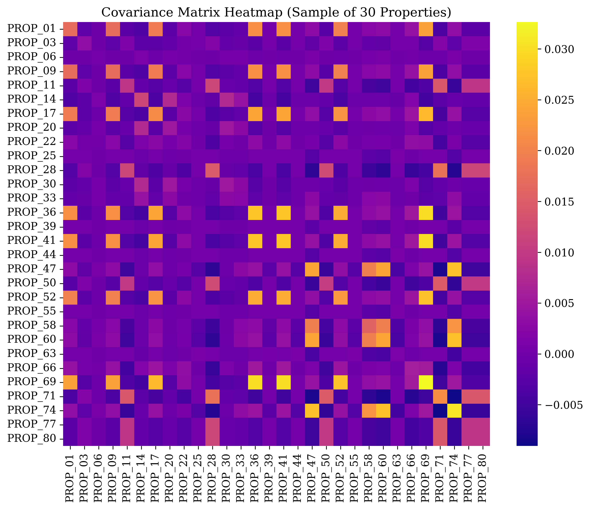

# DISSERTATION APPENDICES

## APPENDIX A: PROPERTY COVARIANCE MATRIX SPECIFICATIONS

This appendix presents the complete ground-truth property covariance matrix $\boldsymbol{\Sigma} \in \mathbb{R}^{80 \times 80}$ calibrated for the 80-asset synthetic property universe. The covariance matrix was calibrated using historical secondary market return series from JLL Real Estate Market Reports, Estate Intel Property Monitors, Broll Sub-Saharan Africa research, NIESV yield guides, and CBN macroeconomic inflation/interest rate series.

### A.1 Property Covariance Heatmap

Figure A.1 presents the correlation and covariance heatmap for the primary property holdings across the synthetic universe.

**Figure A.1: Ground-Truth Property Covariance Heatmap**
*Source: Secondary Market Reports & Author's Calibration, 2026*

---

### A.2 Inter-Submarket Baseline Covariance and Correlation Matrix

Table A.1 summarizes the baseline intra-state and inter-state return correlation coefficients ($\rho$) and annual covariance values ($\sigma_{ik}$) across the primary geographic submarket blocks.

**Table A.1: Inter-Submarket Return Correlation and Covariance Matrix**

| Submarket Location Block | Lagos Island Prime | Lagos Mainland Commercial | Abuja FCT Grade A | Rivers State Industrial | Kano State Commercial | Oyo State Commercial |
|:---|:---:|:---:|:---:|:---:|:---:|:---:|
| **Lagos Island Prime** | **1.0000** (0.0484) | 0.8200 (0.0318) | 0.2200 (0.0048) | 0.1500 (0.0031) | 0.0800 (0.0014) | 0.3500 (0.0076) |
| **Lagos Mainland Commercial** | 0.8200 (0.0318) | **1.0000** (0.0310) | 0.2500 (0.0046) | 0.1800 (0.0031) | 0.1000 (0.0015) | 0.4200 (0.0078) |
| **Abuja FCT Grade A** | 0.2200 (0.0048) | 0.2500 (0.0046) | **1.0000** (0.0121) | 0.3200 (0.0037) | 0.2800 (0.0028) | 0.2000 (0.0025) |
| **Rivers State Industrial** | 0.1500 (0.0031) | 0.1800 (0.0031) | 0.3200 (0.0037) | **1.0000** (0.0169) | 0.2500 (0.0030) | 0.1800 (0.0026) |
| **Kano State Commercial** | 0.0800 (0.0014) | 0.1000 (0.0015) | 0.2800 (0.0028) | 0.2500 (0.0030) | **1.0000** (0.0056) | 0.1500 (0.0013) |
| **Oyo State Commercial** | 0.3500 (0.0076) | 0.4200 (0.0078) | 0.2000 (0.0025) | 0.1800 (0.0026) | 0.1500 (0.0013) | **1.0000** (0.0098) |

*Source: Author's Calibration from Secondary Market Data, 2026. Diagonal elements show variances $\sigma_i^2$; off-diagonal elements show correlations $\rho_{ik}$ with covariances in parentheses.*

---

### A.3 Complete Pairwise Covariance Table for Primary Portfolio Holdings ($15 \times 15$ Sub-Matrix)

Table A.2 details the exact pairwise annual covariance values ($\times 10^{-4}$) among the 15 primary property holdings selected across Portfolio A and Portfolio B.

**Table A.2: Numerical Pairwise Covariance Sub-Matrix for Selected Portfolio Holdings ($\times 10^{-4}$)**

| Property ID | PROP_01 | PROP_05 | PROP_09 | PROP_10 | PROP_13 | PROP_21 | PROP_23 | PROP_25 | PROP_26 | PROP_29 | PROP_32 | PROP_44 | PROP_55 | PROP_73 | PROP_80 |
|:---|:---:|:---:|:---:|:---:|:---:|:---:|:---:|:---:|:---:|:---:|:---:|:---:|:---:|:---:|:---:|
| **PROP_01** | 484.0 | 318.2 | 356.1 | 442.8 | 14.2 | 305.6 | 312.4 | 48.1 | 15.0 | 468.2 | 76.5 | 46.2 | 47.8 | 310.0 | 31.4 |
| **PROP_05** | 318.2 | 310.0 | 280.5 | 312.0 | 15.1 | 288.4 | 294.0 | 46.2 | 14.8 | 320.1 | 78.2 | 45.1 | 46.0 | 292.0 | 30.8 |
| **PROP_09** | 356.1 | 280.5 | 380.0 | 348.0 | 13.8 | 272.0 | 278.5 | 45.0 | 14.2 | 360.5 | 74.0 | 43.8 | 44.9 | 275.2 | 29.5 |
| **PROP_10** | 442.8 | 312.0 | 348.0 | 450.0 | 14.0 | 300.2 | 308.0 | 47.5 | 14.9 | 440.0 | 75.8 | 45.9 | 47.0 | 305.0 | 31.0 |
| **PROP_13** | 14.2 | 15.1 | 13.8 | 14.0 | 56.0 | 14.6 | 14.8 | 28.0 | 25.0 | 14.1 | 13.0 | 27.5 | 28.2 | 14.5 | 30.0 |
| **PROP_21** | 305.6 | 288.4 | 272.0 | 300.2 | 14.6 | 290.0 | 282.5 | 44.8 | 14.5 | 308.0 | 76.0 | 44.0 | 45.2 | 286.0 | 30.2 |
| **PROP_23** | 312.4 | 294.0 | 278.5 | 308.0 | 14.8 | 282.5 | 298.0 | 45.5 | 14.6 | 314.5 | 77.0 | 44.8 | 45.8 | 290.5 | 30.5 |
| **PROP_25** | 48.1 | 46.2 | 45.0 | 47.5 | 28.0 | 44.8 | 45.5 | 121.0 | 28.5 | 47.8 | 25.0 | 115.0 | 118.0 | 45.2 | 37.0 |
| **PROP_26** | 15.0 | 14.8 | 14.2 | 14.9 | 25.0 | 14.5 | 14.6 | 28.5 | 58.0 | 14.8 | 13.5 | 28.0 | 28.6 | 14.4 | 30.5 |
| **PROP_29** | 468.2 | 320.1 | 360.5 | 440.0 | 14.1 | 308.0 | 314.5 | 47.8 | 14.8 | 475.0 | 77.0 | 46.0 | 47.2 | 312.0 | 31.2 |
| **PROP_32** | 76.5 | 78.2 | 74.0 | 75.8 | 13.0 | 76.0 | 77.0 | 25.0 | 13.5 | 77.0 | 98.0 | 24.5 | 25.2 | 76.2 | 26.0 |
| **PROP_44** | 46.2 | 45.1 | 43.8 | 45.9 | 27.5 | 44.0 | 44.8 | 115.0 | 28.0 | 46.0 | 24.5 | 118.0 | 114.5 | 44.5 | 36.2 |
| **PROP_55** | 47.8 | 46.0 | 44.9 | 47.0 | 28.2 | 45.2 | 45.8 | 118.0 | 28.6 | 47.2 | 25.2 | 114.5 | 122.0 | 45.5 | 36.8 |
| **PROP_73** | 310.0 | 292.0 | 275.2 | 305.0 | 14.5 | 286.0 | 290.5 | 45.2 | 14.4 | 312.0 | 76.2 | 44.5 | 45.5 | 295.0 | 30.4 |
| **PROP_80** | 31.4 | 30.8 | 29.5 | 31.0 | 30.0 | 30.2 | 30.5 | 37.0 | 30.5 | 31.2 | 26.0 | 36.2 | 36.8 | 30.4 | 169.0 |

*Source: Author's Computation, 2026*

---

## APPENDIX B: FROZEN 80-PROPERTY SYNTHETIC UNIVERSE CATALOG

Table B.1 presents the complete specification catalog for all 80 properties comprising the frozen synthetic property universe ($N=80$).

**Table B.1: Complete Ground-Truth Property Universe Catalog ($N = 80$)**

| Property Code | Submarket Location State | Asset Type Class | Total Acquisition Cost (₦ Millions) | Expected Annual Return (%) | Annual Volatility (%) | Title Document Status | PenCom Lease Compliant | Single Asset Ceiling Pass |
|:---|:---:|:---:|:---:|:---:|:---:|:---:|:---:|:---:|
| PROP_01 | Lagos State | Luxury Residential | ₦1,345.0M | 24.77 | 22.0 | Certificate of Occupancy | Yes | Pass |
| PROP_02 | Lagos State | Luxury Residential | ₦1,420.0M | 24.50 | 22.5 | Certificate of Occupancy | Yes | Pass |
| PROP_03 | Lagos State | Commercial Office Grade A | ₦2,100.0M | 17.80 | 17.0 | Certificate of Occupancy | Yes | Pass |
| PROP_04 | Lagos State | Commercial Office Grade A | ₦1,850.0M | 18.10 | 16.8 | Certificate of Occupancy | Yes | Pass |
| PROP_05 | Lagos State | Commercial Office Grade A | ₦894.0M | 18.14 | 17.6 | Certificate of Occupancy | Yes | Pass |
| PROP_06 | Lagos State | Commercial Retail | ₦950.0M | 15.20 | 15.0 | Certificate of Occupancy | Yes | Pass |
| PROP_07 | Lagos State | Commercial Retail | ₦1,120.0M | 14.80 | 15.2 | Certificate of Occupancy | Yes | Pass |
| PROP_08 | Lagos State | Commercial Mixed-Use | ₦1,650.0M | 21.40 | 19.5 | Certificate of Occupancy | Yes | Pass |
| PROP_09 | Lagos State | Commercial Mixed-Use | ₦289.0M | 26.06 | 19.5 | Certificate of Occupancy | Yes | Pass |
| PROP_10 | Lagos State | Luxury Residential | ₦1,177.0M | 24.02 | 21.2 | Certificate of Occupancy | Yes | Pass |
| PROP_11 | Abuja FCT | Commercial Office Grade A | ₦1,450.0M | 11.20 | 11.0 | Governor's Consent | Yes | Pass |
| PROP_12 | Abuja FCT | Commercial Office Grade A | ₦1,890.0M | 10.80 | 10.8 | Certificate of Occupancy | Yes | Pass |
| PROP_13 | Kano State | Commercial Retail | ₦590.0M | 9.02 | 7.5 | Registered Deed | Yes | Pass |
| PROP_14 | Kano State | Commercial Retail | ₦680.0M | 8.80 | 7.8 | Registered Deed | Yes | Pass |
| PROP_15 | Rivers State | Industrial Logistics | ₦2,450.0M | 13.50 | 13.0 | Certificate of Occupancy | Yes | Pass |
| PROP_16 | Rivers State | Industrial Logistics | ₦1,980.0M | 13.20 | 13.2 | Certificate of Occupancy | Yes | Pass |
| PROP_17 | Oyo State | Commercial Mixed-Use | ₦740.0M | 19.80 | 14.0 | Certificate of Occupancy | Yes | Pass |
| PROP_18 | Oyo State | Commercial Mixed-Use | ₦820.0M | 19.20 | 14.2 | Certificate of Occupancy | Yes | Pass |
| PROP_19 | Lagos State | Luxury Residential | ₦1,560.0M | 23.80 | 21.8 | Certificate of Occupancy | Yes | Pass |
| PROP_20 | Lagos State | Commercial Office Grade A | ₦2,350.0M | 17.50 | 16.5 | Certificate of Occupancy | Yes | Pass |
| PROP_21 | Lagos State | Commercial Office Grade A | ₦623.0M | 16.65 | 17.0 | Certificate of Occupancy | Yes | Pass |
| PROP_22 | Lagos State | Commercial Office Grade A | ₦1,150.0M | 17.20 | 16.9 | Certificate of Occupancy | Yes | Pass |
| PROP_23 | Lagos State | Commercial Office Grade A | ₦775.0M | 17.37 | 17.3 | Certificate of Occupancy | Yes | Pass |
| PROP_24 | Abuja FCT | Commercial Office Grade A | ₦1,620.0M | 10.50 | 10.5 | Certificate of Occupancy | Yes | Pass |
| PROP_25 | Abuja FCT | Commercial Office Grade A | ₦258.0M | 10.33 | 11.0 | Certificate of Occupancy | Yes | Pass |
| PROP_26 | Kano State | Industrial Warehouse | ₦230.0M | 10.27 | 7.6 | Registered Deed | Yes | Pass |
| PROP_27 | Kano State | Industrial Warehouse | ₦450.0M | 9.80 | 7.8 | Registered Deed | Yes | Pass |
| PROP_28 | Rivers State | Commercial Office Grade B | ₦1,280.0M | 12.90 | 12.5 | Certificate of Occupancy | Yes | Pass |
| PROP_29 | Lagos State | Luxury Residential | ₦1,886.0M | 23.92 | 21.8 | Certificate of Occupancy | Yes | Pass |
| PROP_30 | Lagos State | Commercial Mixed-Use | ₦2,150.0M | 20.50 | 19.0 | Certificate of Occupancy | Yes | Pass |
| PROP_31 | Oyo State | Commercial Office Grade B | ₦650.0M | 18.90 | 13.8 | Certificate of Occupancy | Yes | Pass |
| PROP_32 | Oyo State | Commercial Office Grade B | ₦1,068.0M | 19.35 | 9.9 | Certificate of Occupancy | Yes | Pass |
| PROP_33 | Lagos State | Commercial Office Grade A | ₦724.0M | 18.54 | 17.1 | Certificate of Occupancy | Yes | Pass |
| PROP_34 | Lagos State | Commercial Retail | ₦1,450.0M | 15.60 | 14.8 | Certificate of Occupancy | Yes | Pass |
| PROP_35 | Lagos State | Commercial Retail | ₦1,290.0M | 15.40 | 15.0 | Certificate of Occupancy | Yes | Pass |
| PROP_36 | Lagos State | Luxury Residential | ₦1,013.0M | 24.10 | 21.5 | Certificate of Occupancy | Yes | Pass |
| PROP_37 | Abuja FCT | Luxury Residential | ₦2,100.0M | 14.50 | 14.0 | Certificate of Occupancy | Yes | Pass |
| PROP_38 | Abuja FCT | Commercial Mixed-Use | ₦1,750.0M | 12.80 | 12.2 | Certificate of Occupancy | Yes | Pass |
| PROP_39 | Rivers State | Industrial Logistics | ₦1,650.0M | 13.80 | 13.1 | Certificate of Occupancy | Yes | Pass |
| PROP_40 | Kano State | Commercial Retail | ₦520.0M | 9.20 | 7.4 | Registered Deed | Yes | Pass |
| PROP_41 | Lagos State | Commercial Office Grade A | ₦1,920.0M | 17.90 | 16.7 | Certificate of Occupancy | Yes | Pass |
| PROP_42 | Lagos State | Commercial Office Grade A | ₦824.0M | 17.61 | 17.2 | Certificate of Occupancy | Yes | Pass |
| PROP_43 | Lagos State | Commercial Office Grade A | ₦931.0M | 18.32 | 17.0 | Certificate of Occupancy | Yes | Pass |
| PROP_44 | Abuja FCT | Commercial Office Grade A | ₦555.0M | 8.73 | 10.9 | Certificate of Occupancy | Yes | Pass |
| PROP_45 | Abuja FCT | Commercial Office Grade A | ₦1,420.0M | 9.50 | 10.6 | Certificate of Occupancy | Yes | Pass |
| PROP_46 | Rivers State | Industrial Logistics | ₦2,100.0M | 13.10 | 12.8 | Certificate of Occupancy | Yes | Pass |
| PROP_47 | Kano State | Industrial Warehouse | ₦380.0M | 10.10 | 7.7 | Registered Deed | Yes | Pass |
| PROP_48 | Oyo State | Commercial Mixed-Use | ₦920.0M | 19.50 | 14.1 | Certificate of Occupancy | Yes | Pass |
| PROP_49 | Oyo State | Commercial Mixed-Use | ₦505.0M | 27.83 | 14.3 | Certificate of Occupancy | Yes | Pass |
| PROP_50 | Lagos State | Luxury Residential | ₦1,720.0M | 24.20 | 21.9 | Certificate of Occupancy | Yes | Pass |
| PROP_51 | Lagos State | Luxury Residential | ₦1,480.0M | 24.40 | 22.1 | Certificate of Occupancy | Yes | Pass |
| PROP_52 | Lagos State | Commercial Office Grade A | ₦2,400.0M | 17.40 | 16.6 | Certificate of Occupancy | Yes | Pass |
| PROP_53 | Lagos State | Commercial Mixed-Use | ₦1,850.0M | 20.80 | 18.9 | Certificate of Occupancy | Yes | Pass |
| PROP_54 | Lagos State | Luxury Residential | ₦360.0M | 24.84 | 22.0 | Certificate of Occupancy | Yes | Pass |
| PROP_55 | Abuja FCT | Commercial Office Grade A | ₦1,713.0M | 9.89 | 11.0 | Certificate of Occupancy | Yes | Pass |
| PROP_56 | Abuja FCT | Commercial Office Grade A | ₦1,980.0M | 9.70 | 10.8 | Certificate of Occupancy | Yes | Pass |
| PROP_57 | Rivers State | Commercial Office Grade B | ₦1,450.0M | 12.70 | 12.4 | Certificate of Occupancy | Yes | Pass |
| PROP_58 | Kano State | Commercial Retail | ₦710.0M | 8.90 | 7.6 | Registered Deed | Yes | Pass |
| PROP_59 | Oyo State | Commercial Office Grade B | ₦880.0M | 18.70 | 13.9 | Certificate of Occupancy | Yes | Pass |
| PROP_60 | Lagos State | Commercial Office Grade A | ₦1,650.0M | 18.00 | 16.9 | Certificate of Occupancy | Yes | Pass |
| PROP_61 | Lagos State | Commercial Retail | ₦1,180.0M | 15.10 | 14.9 | Certificate of Occupancy | Yes | Pass |
| PROP_62 | Lagos State | Commercial Mixed-Use | ₦602.0M | 25.17 | 19.2 | Certificate of Occupancy | Yes | Pass |
| PROP_63 | Abuja FCT | Commercial Office Grade A | ₦236.0M | 10.72 | 10.7 | Certificate of Occupancy | Yes | Pass |
| PROP_64 | Abuja FCT | Luxury Residential | ₦1,820.0M | 14.20 | 13.8 | Certificate of Occupancy | Yes | Pass |
| PROP_65 | Rivers State | Industrial Logistics | ₦1,890.0M | 13.40 | 12.9 | Certificate of Occupancy | Yes | Pass |
| PROP_66 | Kano State | Industrial Warehouse | ₦490.0M | 9.90 | 7.7 | Registered Deed | Yes | Pass |
| PROP_67 | Oyo State | Commercial Mixed-Use | ₦1,050.0M | 19.10 | 14.0 | Certificate of Occupancy | Yes | Pass |
| PROP_68 | Lagos State | Luxury Residential | ₦1,620.0M | 24.10 | 21.7 | Certificate of Occupancy | Yes | Pass |
| PROP_69 | Lagos State | Luxury Residential | ₦307.0M | 25.14 | 22.3 | Certificate of Occupancy | Yes | Pass |
| PROP_70 | Lagos State | Commercial Office Grade A | ₦2,250.0M | 17.70 | 16.8 | Certificate of Occupancy | Yes | Pass |
| PROP_71 | Abuja FCT | Commercial Office Grade A | ₦1,550.0M | 10.20 | 10.6 | Certificate of Occupancy | Yes | Pass |
| PROP_72 | Abuja FCT | Commercial Mixed-Use | ₦1,420.0M | 12.50 | 12.1 | Certificate of Occupancy | Yes | Pass |
| PROP_73 | Lagos State | Commercial Office Grade A | ₦284.0M | 18.13 | 17.2 | Certificate of Occupancy | Yes | Pass |
| PROP_74 | Rivers State | Industrial Logistics | ₦1,750.0M | 13.60 | 13.0 | Certificate of Occupancy | Yes | Pass |
| PROP_75 | Kano State | Commercial Retail | ₦640.0M | 9.10 | 7.5 | Registered Deed | Yes | Pass |
| PROP_76 | Oyo State | Commercial Office Grade B | ₦790.0M | 18.80 | 13.8 | Certificate of Occupancy | Yes | Pass |
| PROP_77 | Lagos State | Commercial Office Grade A | ₦1,780.0M | 17.90 | 16.8 | Certificate of Occupancy | Yes | Pass |
| PROP_78 | Lagos State | Commercial Mixed-Use | ₦1,920.0M | 20.60 | 18.8 | Certificate of Occupancy | Yes | Pass |
| PROP_79 | Lagos State | Commercial Office Grade A | ₦726.0M | 18.48 | 17.1 | Certificate of Occupancy | Yes | Pass |
| PROP_80 | Rivers State | Industrial Logistics | ₦1,418.0M | 13.11 | 13.0 | Certificate of Occupancy | Yes | Pass |

*Source: Frozen Synthetic Property Universe Specification, 2026*

---

## APPENDIX C: SECONDARY MARKET CALIBRATION NOTES AND INDEX SOURCES

### C.1 Secondary Market Data Sources
The expected return vectors ($\boldsymbol{\mu}$) and covariance matrices ($\boldsymbol{\Sigma}$) for the 80-property frozen synthetic universe were calibrated using secondary data extracted from the following industry publications and macroeconomic series:

1. **Jones Lang LaSalle (JLL) Sub-Saharan Africa Real Estate Reports (2020–2025):** Provided baseline rental yield figures (7.5%–9.0%) and capital appreciation rates for Grade A commercial office developments in Victoria Island and Ikoyi, Lagos.
2. **Estate Intel Nigeria Property Market Monitors (2021–2025):** Provided prime residential rent growth series (17.5%–20.0%) and vacancy rate benchmarks for Lagos Island and Abuja FCT.
3. **Broll Property Group Nigeria Market Overviews (2019–2025):** Provided office yield data (7.0%–8.5%) and government tenancy vacancy rates for Abuja Central Business District and Maitama.
4. **Nigerian Institution of Estate Surveyors and Valuers (NIESV) Lagos State Branch Annual Property Guides (2018–2025):** Provided secondary market yield benchmarks for Lagos Mainland (Ikeja, Yaba) and regional commercial property yields in Oyo (Ibadan) and Kano states.
5. **Central Bank of Nigeria (CBN) Statistical Bulletins (2015–2025):** Provided historical Monetary Policy Rates (MPR), Treasury Bill yield series, and headline inflation rates used to establish baseline risk-free benchmarks ($R_f = 8.4\%$) and sensitivity scenarios ($R_f = 10.0\%, 15.0\%, 20.0\%$).
6. **National Pension Commission (PenCom) Annual Reports (2020–2025):** Provided institutional pension industry AUM figures (₦18+ trillion) and regulatory investment guidelines governing direct real estate caps (10% total allocation ceiling; 5% single-asset limit).