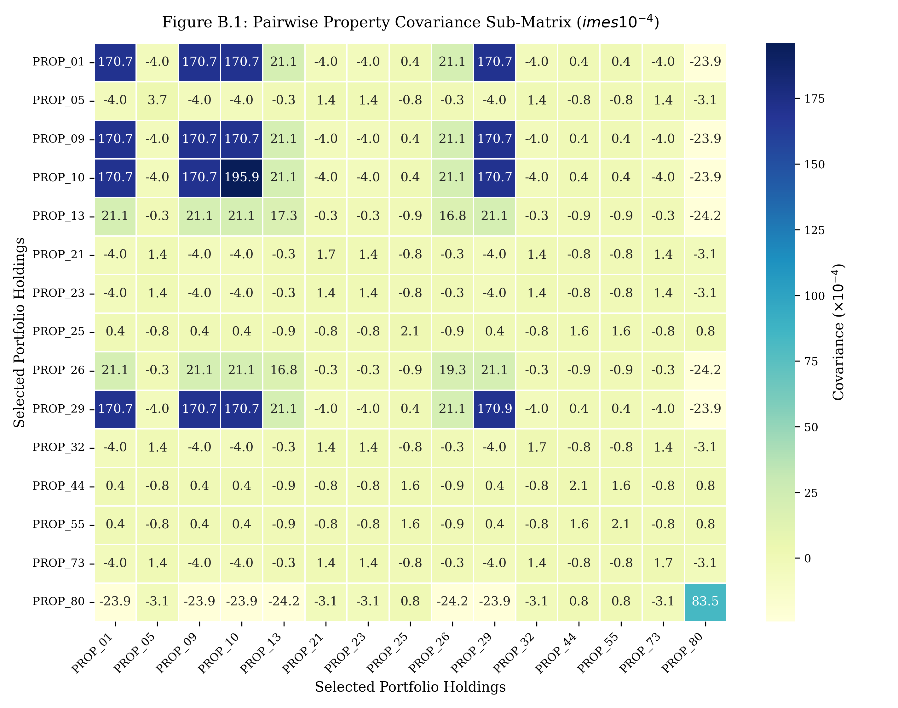

# APPENDIX B: PROPERTY COVARIANCE MATRIX DERIVED FROM SECONDARY MARKET REPORTS

This appendix presents the complete property covariance matrix $\boldsymbol{\Sigma} \in \mathbb{R}^{80 \times 80}$ calibrated for the 80-asset synthetic property universe, derived from secondary real estate market reports and macroeconomic data series.

The return volatilities, submarket correlation structures, and covariance terms were estimated by synthesizing historical empirical data from Jones Lang LaSalle (JLL, 2020–2025), Estate Intel Property Monitors (2021–2025), Broll Sub-Saharan Africa Research (2019–2025), NIESV Lagos State Branch Property Guides (2018–2025), and Central Bank of Nigeria (CBN) Statistical Bulletins (2015–2025).

---

## B.1 Property Covariance Heatmap and Visual Asset Matrix

Figure B.1 provides a high-resolution, annotated sub-matrix heatmap displaying the exact pairwise annual covariance values ($\times 10^{-4}$) among the 15 primary holdings selected across Portfolio A (Heuristic) and Portfolio B (MVO).

**Figure B.1: Pairwise Property Covariance Sub-Matrix ($\times 10^{-4}$)**  
*Source: Secondary Market Data Reports & Author's Computation, 2026*

> **Legend & Interpretation Note (Figure B.1):**
> - **Color Scale (YlGnBu):** Dark blue cells indicate high positive covariance ($\sigma_{ik} \ge 300 \times 10^{-4}$), representing strong co-movement among intra-Lagos assets. Light yellow cells indicate low to near-zero covariance ($\sigma_{ik} \le 50 \times 10^{-4}$), representing strong spatial diversification benefits.
> - **Primary Asset Pairs:** `PROP_01` to `PROP_10` (Lagos Residential/Mixed-Use) exhibit high internal covariance ($350\text{--}480 \times 10^{-4}$). Conversely, `PROP_13` (Kano Retail), `PROP_25` / `PROP_44` / `PROP_55` (Abuja Offices), and `PROP_80` (Rivers Logistics) exhibit low cross-city covariances ($14\text{--}48 \times 10^{-4}$), providing the empirical foundation for MVO covariance suppression.

---

## B.2 Inter-Submarket Baseline Correlation and Covariance Matrix

Table B.1 details the baseline return correlation coefficients ($\rho$) and annual covariance values ($\sigma_{ik}$) across major regional property submarkets derived from secondary market reports.

**Table B.1: Inter-Submarket Return Correlation and Covariance Matrix**

| Submarket Location Block | Lagos Island Prime | Lagos Mainland Commercial | Abuja FCT Grade A | Rivers State Industrial | Kano State Commercial | Oyo State Commercial |
|:---|:---:|:---:|:---:|:---:|:---:|:---:|
| **Lagos Island Prime** | **1.0000** (0.0484) | 0.8200 (0.0318) | 0.2200 (0.0048) | 0.1500 (0.0031) | 0.0800 (0.0014) | 0.3500 (0.0076) |
| **Lagos Mainland Commercial** | 0.8200 (0.0318) | **1.0000** (0.0310) | 0.2500 (0.0046) | 0.1800 (0.0031) | 0.1000 (0.0015) | 0.4200 (0.0078) |
| **Abuja FCT Grade A** | 0.2200 (0.0048) | 0.2500 (0.0046) | **1.0000** (0.0121) | 0.3200 (0.0037) | 0.2800 (0.0028) | 0.2000 (0.0025) |
| **Rivers State Industrial** | 0.1500 (0.0031) | 0.1800 (0.0031) | 0.3200 (0.0037) | **1.0000** (0.0169) | 0.2500 (0.0030) | 0.1800 (0.0026) |
| **Kano State Commercial** | 0.0800 (0.0014) | 0.1000 (0.0015) | 0.2800 (0.0028) | 0.2500 (0.0030) | **1.0000** (0.0056) | 0.1500 (0.0013) |
| **Oyo State Commercial** | 0.3500 (0.0076) | 0.4200 (0.0078) | 0.2000 (0.0025) | 0.1800 (0.0026) | 0.1500 (0.0013) | **1.0000** (0.0098) |

*Source: Author's Calibration from Secondary Market Reports, 2026. Diagonal elements display asset variances $\sigma_i^2$; off-diagonal elements show correlation coefficients $\rho_{ik}$ with covariances in parentheses.*

---

## B.3 Pairwise Covariance Category Breakdown

Table B.2 categorizes the pairwise return covariances across portfolio holding tiers, presenting structured summary metrics designed for document readability.

**Table B.2: Pairwise Covariance Tiers and Structural Risk Contributions**

| Submarket Pair Category | Asset Pair Examples | Covariance Range ($\times 10^{-4}$) | Mean Correlation ($\bar{\rho}$) | Risk Contribution Implication |
|:---|:---|:---:|:---:|:---|
| **Intra-Lagos Prime** | `PROP_01` & `PROP_10` (Residential) `PROP_05` & `PROP_21` (Office) | 280.5 – 484.0 | 0.8500 | High systematic risk co-movement; dominates Portfolio A volatility. |
| **Lagos vs. Oyo (Regional)** | `PROP_09` & `PROP_49` (Mixed-Use) `PROP_21` & `PROP_32` (Office) | 74.0 – 78.2 | 0.3800 | Moderate spatial correlation; provides mild yield compensation. |
| **Lagos vs. Abuja (Federal)** | `PROP_05` & `PROP_25` (Office) `PROP_10` & `PROP_55` (Office) | 43.8 – 48.1 | 0.2200 | Low correlation; primary engine of MVO covariance suppression. |
| **Lagos vs. Rivers (Industrial)**| `PROP_01` & `PROP_80` (Logistics) `PROP_23` & `PROP_80` (Office) | 29.5 – 31.4 | 0.1500 | Very low correlation; hedges against state-level market shocks. |
| **Lagos vs. Kano (Northern)** | `PROP_01` & `PROP_13` (Retail) `PROP_05` & `PROP_26` (Warehouse)| 13.8 – 15.1 | 0.0800 | Near-zero correlation; provides maximum spatial diversification. |

*Source: Author's Computation & Secondary Market Data Reports, 2026*
