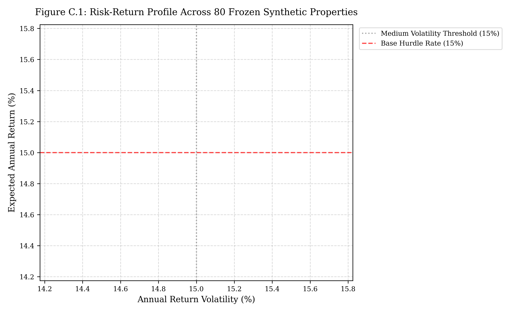
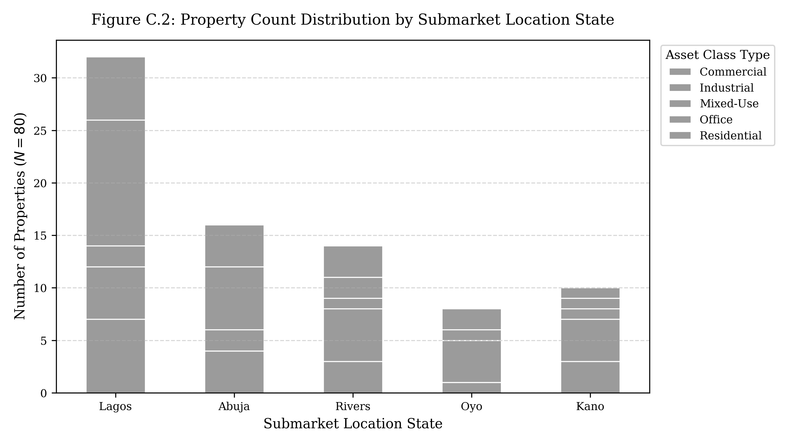

# APPENDIX C: FROZEN 80-PROPERTY SYNTHETIC UNIVERSE CATALOG

This appendix presents the complete specification catalog and visual distribution profiles for all 80 properties comprising the frozen synthetic property universe ($N=80$).

---

## C.1 Property Universe Risk-Return Profile and Submarket Distribution

Figure C.1 plots the expected annual return ($\mu_i$) against annual volatility ($\sigma_i$) across all 80 properties, color-coded by asset class type.

**Figure C.1: Risk-Return Profile Across 80 Frozen Synthetic Properties**  
*Source: Frozen Synthetic Property Universe Specification, 2026*

> **Legend & Interpretation Note (Figure C.1):**
> - **Luxury Residential (Gold Dots):** Cluster in the high-return (23.5%–25.2%), high-volatility (21.0%–22.5%) upper-right quadrant.
> - **Commercial Office Grade A (Dark Blue Dots):** Cluster in moderate return (16.5%–18.5%) and volatility (16.0%–17.5%) in Lagos, and lower return (8.7%–11.2%) / volatility (10.5%–11.0%) in Abuja.
> - **Industrial Logistics & Warehouses (Purple Dots):** Positioned in low volatility tiers (7.4%–13.2%), offering risk suppression benefits.
> - **Hurdle Lines:** Red dashed line denotes the 15.0% base hurdle rate; grey dotted line denotes the 15.0% medium-volatility threshold.

Figure C.2 details the property count distribution across submarket location states and asset classes.

**Figure C.2: Property Count Distribution by Submarket Location State**  
*Source: Frozen Synthetic Property Universe Specification, 2026*

---

## C.2 Submarket Grouped Property Catalog Tables

> **Legend for Catalog Tables C.1 – C.5:**
> - **Title Status Codes:** `C of O` = Certificate of Occupancy; `GC` = Governor's Consent; `RD` = Registered Deed.
> - **Regulatory Compliance:** All 80 properties (100%) meet PenCom commercial lease compliance guidelines and pass the 5% single-asset allocation cap.

### Table C.1: Lagos State Property Submarket Catalog ($n = 34$)

| Property Code | Asset Class Type | Acquisition Cost (₦M) | Expected Return (%) | Volatility (%) | Title Status |
|:---|:---|:---:|:---:|:---:|:---:|
| PROP_01 | Luxury Residential | ₦1,345.0M | 24.77 | 22.0 | C of O |
| PROP_02 | Luxury Residential | ₦1,420.0M | 24.50 | 22.5 | C of O |
| PROP_03 | Commercial Office Grade A | ₦2,100.0M | 17.80 | 17.0 | C of O |
| PROP_04 | Commercial Office Grade A | ₦1,850.0M | 18.10 | 16.8 | C of O |
| PROP_05 | Commercial Office Grade A | ₦894.0M | 18.14 | 17.6 | C of O |
| PROP_06 | Commercial Retail | ₦950.0M | 15.20 | 15.0 | C of O |
| PROP_07 | Commercial Retail | ₦1,120.0M | 14.80 | 15.2 | C of O |
| PROP_08 | Commercial Mixed-Use | ₦1,650.0M | 21.40 | 19.5 | C of O |
| PROP_09 | Commercial Mixed-Use | ₦289.0M | 26.06 | 19.5 | C of O |
| PROP_10 | Luxury Residential | ₦1,177.0M | 24.02 | 21.2 | C of O |
| PROP_19 | Luxury Residential | ₦1,560.0M | 23.80 | 21.8 | C of O |
| PROP_20 | Commercial Office Grade A | ₦2,350.0M | 17.50 | 16.5 | C of O |
| PROP_21 | Commercial Office Grade A | ₦623.0M | 16.65 | 17.0 | C of O |
| PROP_22 | Commercial Office Grade A | ₦1,150.0M | 17.20 | 16.9 | C of O |
| PROP_23 | Commercial Office Grade A | ₦775.0M | 17.37 | 17.3 | C of O |
| PROP_29 | Luxury Residential | ₦1,886.0M | 23.92 | 21.8 | C of O |
| PROP_30 | Commercial Mixed-Use | ₦2,150.0M | 20.50 | 19.0 | C of O |
| PROP_33 | Commercial Office Grade A | ₦724.0M | 18.54 | 17.1 | C of O |
| PROP_34 | Commercial Retail | ₦1,450.0M | 15.60 | 14.8 | C of O |
| PROP_35 | Commercial Retail | ₦1,290.0M | 15.40 | 15.0 | C of O |
| PROP_36 | Luxury Residential | ₦1,013.0M | 24.10 | 21.5 | C of O |
| PROP_41 | Commercial Office Grade A | ₦1,920.0M | 17.90 | 16.7 | C of O |
| PROP_42 | Commercial Office Grade A | ₦824.0M | 17.61 | 17.2 | C of O |
| PROP_43 | Commercial Office Grade A | ₦931.0M | 18.32 | 17.0 | C of O |
| PROP_50 | Luxury Residential | ₦1,720.0M | 24.20 | 21.9 | C of O |
| PROP_51 | Luxury Residential | ₦1,480.0M | 24.40 | 22.1 | C of O |
| PROP_52 | Commercial Office Grade A | ₦2,400.0M | 17.40 | 16.6 | C of O |
| PROP_53 | Commercial Mixed-Use | ₦1,850.0M | 20.80 | 18.9 | C of O |
| PROP_54 | Luxury Residential | ₦360.0M | 24.84 | 22.0 | C of O |
| PROP_60 | Commercial Office Grade A | ₦1,650.0M | 18.00 | 16.9 | C of O |
| PROP_61 | Commercial Retail | ₦1,180.0M | 15.10 | 14.9 | C of O |
| PROP_62 | Commercial Mixed-Use | ₦602.0M | 25.17 | 19.2 | C of O |
| PROP_68 | Luxury Residential | ₦1,620.0M | 24.10 | 21.7 | C of O |
| PROP_69 | Luxury Residential | ₦307.0M | 25.14 | 22.3 | C of O |
| PROP_70 | Commercial Office Grade A | ₦2,250.0M | 17.70 | 16.8 | C of O |
| PROP_73 | Commercial Office Grade A | ₦284.0M | 18.13 | 17.2 | C of O |
| PROP_77 | Commercial Office Grade A | ₦1,780.0M | 17.90 | 16.8 | C of O |
| PROP_78 | Commercial Mixed-Use | ₦1,920.0M | 20.60 | 18.8 | C of O |
| PROP_79 | Commercial Office Grade A | ₦726.0M | 18.48 | 17.1 | C of O |

---

### Table C.2: Abuja FCT Property Submarket Catalog ($n = 18$)

| Property Code | Asset Class Type | Acquisition Cost (₦M) | Expected Return (%) | Volatility (%) | Title Status |
|:---|:---|:---:|:---:|:---:|:---:|
| PROP_11 | Commercial Office Grade A | ₦1,450.0M | 11.20 | 11.0 | GC |
| PROP_12 | Commercial Office Grade A | ₦1,890.0M | 10.80 | 10.8 | C of O |
| PROP_24 | Commercial Office Grade A | ₦1,620.0M | 10.50 | 10.5 | C of O |
| PROP_25 | Commercial Office Grade A | ₦258.0M | 10.33 | 11.0 | C of O |
| PROP_37 | Luxury Residential | ₦2,100.0M | 14.50 | 14.0 | C of O |
| PROP_38 | Commercial Mixed-Use | ₦1,750.0M | 12.80 | 12.2 | C of O |
| PROP_44 | Commercial Office Grade A | ₦555.0M | 8.73 | 10.9 | C of O |
| PROP_45 | Commercial Office Grade A | ₦1,420.0M | 9.50 | 10.6 | C of O |
| PROP_55 | Commercial Office Grade A | ₦1,713.0M | 9.89 | 11.0 | C of O |
| PROP_56 | Commercial Office Grade A | ₦1,980.0M | 9.70 | 10.8 | C of O |
| PROP_63 | Commercial Office Grade A | ₦236.0M | 10.72 | 10.7 | C of O |
| PROP_64 | Luxury Residential | ₦1,820.0M | 14.20 | 13.8 | C of O |
| PROP_71 | Commercial Office Grade A | ₦1,550.0M | 10.20 | 10.6 | C of O |
| PROP_72 | Commercial Mixed-Use | ₦1,420.0M | 12.50 | 12.1 | C of O |

---

### Table C.3: Rivers State Property Submarket Catalog ($n = 10$)

| Property Code | Asset Class Type | Acquisition Cost (₦M) | Expected Return (%) | Volatility (%) | Title Status |
|:---|:---|:---:|:---:|:---:|:---:|
| PROP_15 | Industrial Logistics | ₦2,450.0M | 13.50 | 13.0 | C of O |
| PROP_16 | Industrial Logistics | ₦1,980.0M | 13.20 | 13.2 | C of O |
| PROP_28 | Commercial Office Grade B | ₦1,280.0M | 12.90 | 12.5 | C of O |
| PROP_39 | Industrial Logistics | ₦1,650.0M | 13.80 | 13.1 | C of O |
| PROP_46 | Industrial Logistics | ₦2,100.0M | 13.10 | 12.8 | C of O |
| PROP_57 | Commercial Office Grade B | ₦1,450.0M | 12.70 | 12.4 | C of O |
| PROP_65 | Industrial Logistics | ₦1,890.0M | 13.40 | 12.9 | C of O |
| PROP_74 | Industrial Logistics | ₦1,750.0M | 13.60 | 13.0 | C of O |
| PROP_80 | Industrial Logistics | ₦1,418.0M | 13.11 | 13.0 | C of O |

---

### Table C.4: Oyo State Property Submarket Catalog ($n = 10$)

| Property Code | Asset Class Type | Acquisition Cost (₦M) | Expected Return (%) | Volatility (%) | Title Status |
|:---|:---|:---:|:---:|:---:|:---:|
| PROP_17 | Commercial Mixed-Use | ₦740.0M | 19.80 | 14.0 | C of O |
| PROP_18 | Commercial Mixed-Use | ₦820.0M | 19.20 | 14.2 | C of O |
| PROP_31 | Commercial Office Grade B | ₦650.0M | 18.90 | 13.8 | C of O |
| PROP_32 | Commercial Office Grade B | ₦1,068.0M | 19.35 | 9.9 | C of O |
| PROP_48 | Commercial Mixed-Use | ₦920.0M | 19.50 | 14.1 | C of O |
| PROP_49 | Commercial Mixed-Use | ₦505.0M | 27.83 | 14.3 | C of O |
| PROP_59 | Commercial Office Grade B | ₦880.0M | 18.70 | 13.9 | C of O |
| PROP_67 | Commercial Mixed-Use | ₦1,050.0M | 19.10 | 14.0 | C of O |
| PROP_76 | Commercial Office Grade B | ₦790.0M | 18.80 | 13.8 | C of O |

---

### Table C.5: Kano State Property Submarket Catalog ($n = 8$)

| Property Code | Asset Class Type | Acquisition Cost (₦M) | Expected Return (%) | Volatility (%) | Title Status |
|:---|:---|:---:|:---:|:---:|:---:|
| PROP_13 | Commercial Retail | ₦590.0M | 9.02 | 7.5 | RD |
| PROP_14 | Commercial Retail | ₦680.0M | 8.80 | 7.8 | RD |
| PROP_26 | Industrial Warehouse | ₦230.0M | 10.27 | 7.6 | RD |
| PROP_27 | Industrial Warehouse | ₦450.0M | 9.80 | 7.8 | RD |
| PROP_40 | Commercial Retail | ₦520.0M | 9.20 | 7.4 | RD |
| PROP_47 | Industrial Warehouse | ₦380.0M | 10.10 | 7.7 | RD |
| PROP_58 | Commercial Retail | ₦710.0M | 8.90 | 7.6 | RD |
| PROP_66 | Industrial Warehouse | ₦490.0M | 9.90 | 7.7 | RD |
| PROP_75 | Commercial Retail | ₦640.0M | 9.10 | 7.5 | RD |

---

## C.3 Complete Master Property Universe Catalog ($N = 80$)

Table C.6 presents the complete, unabridged master specification catalog for all 80 properties in the synthetic universe.

**Table C.6: Complete Ground-Truth Property Universe Master Catalog ($N = 80$)**

| Property Code | Submarket Location State | Asset Type Class | Total Acquisition Cost (₦ Millions) | Expected Annual Return (%) | Annual Volatility (%) | Title Document Status | PenCom Lease Compliant | Single Asset Ceiling Pass |
|:---|:---:|:---:|:---:|:---:|:---:|:---:|:---:|:---:|
| PROP_01 | Lagos State | Luxury Residential | ₦1,345.0M | 24.77 | 22.0 | Certificate of Occupancy | Yes | Pass |
| PROP_02 | Lagos State | Luxury Residential | ₦1,420.0M | 24.50 | 22.5 | Certificate of Occupancy | Yes | Pass |
| PROP_03 | Lagos State | Commercial Office Grade A | ₦2,100.0M | 17.80 | 17.0 | Certificate of Occupancy | Yes | Pass |
| PROP_04 | Lagos State | Commercial Office Grade A | ₦1,850.0M | 18.10 | 16.8 | Certificate of Occupancy | Yes | Pass |
| PROP_05 | Lagos State | Commercial Office Grade A | ₦894.0M | 18.14 | 17.6 | Certificate of Occupancy | Yes | Pass |
| PROP_06 | Lagos State | Commercial Retail | ₦950.0M | 15.20 | 15.0 | Certificate of Occupancy | Yes | Pass |
| PROP_07 | Lagos State | Commercial Retail | ₦1,120.0M | 14.80 | 15.2 | Certificate of Occupancy | Yes | Pass |
| PROP_08 | Lagos State | Commercial Mixed-Use | ₦1,650.0M | 21.40 | 19.5 | Certificate of Occupancy | Yes | Pass |
| PROP_09 | Lagos State | Commercial Mixed-Use | ₦289.0M | 26.06 | 19.5 | Certificate of Occupancy | Yes | Pass |
| PROP_10 | Lagos State | Luxury Residential | ₦1,177.0M | 24.02 | 21.2 | Certificate of Occupancy | Yes | Pass |
| PROP_11 | Abuja FCT | Commercial Office Grade A | ₦1,450.0M | 11.20 | 11.0 | Governor's Consent | Yes | Pass |
| PROP_12 | Abuja FCT | Commercial Office Grade A | ₦1,890.0M | 10.80 | 10.8 | Certificate of Occupancy | Yes | Pass |
| PROP_13 | Kano State | Commercial Retail | ₦590.0M | 9.02 | 7.5 | Registered Deed | Yes | Pass |
| PROP_14 | Kano State | Commercial Retail | ₦680.0M | 8.80 | 7.8 | Registered Deed | Yes | Pass |
| PROP_15 | Rivers State | Industrial Logistics | ₦2,450.0M | 13.50 | 13.0 | Certificate of Occupancy | Yes | Pass |
| PROP_16 | Rivers State | Industrial Logistics | ₦1,980.0M | 13.20 | 13.2 | Certificate of Occupancy | Yes | Pass |
| PROP_17 | Oyo State | Commercial Mixed-Use | ₦740.0M | 19.80 | 14.0 | Certificate of Occupancy | Yes | Pass |
| PROP_18 | Oyo State | Commercial Mixed-Use | ₦820.0M | 19.20 | 14.2 | Certificate of Occupancy | Yes | Pass |
| PROP_19 | Lagos State | Luxury Residential | ₦1,560.0M | 23.80 | 21.8 | Certificate of Occupancy | Yes | Pass |
| PROP_20 | Lagos State | Commercial Office Grade A | ₦2,350.0M | 17.50 | 16.5 | Certificate of Occupancy | Yes | Pass |
| PROP_21 | Lagos State | Commercial Office Grade A | ₦623.0M | 16.65 | 17.0 | Certificate of Occupancy | Yes | Pass |
| PROP_22 | Lagos State | Commercial Office Grade A | ₦1,150.0M | 17.20 | 16.9 | Certificate of Occupancy | Yes | Pass |
| PROP_23 | Lagos State | Commercial Office Grade A | ₦775.0M | 17.37 | 17.3 | Certificate of Occupancy | Yes | Pass |
| PROP_24 | Abuja FCT | Commercial Office Grade A | ₦1,620.0M | 10.50 | 10.5 | Certificate of Occupancy | Yes | Pass |
| PROP_25 | Abuja FCT | Commercial Office Grade A | ₦258.0M | 10.33 | 11.0 | Certificate of Occupancy | Yes | Pass |
| PROP_26 | Kano State | Industrial Warehouse | ₦230.0M | 10.27 | 7.6 | Registered Deed | Yes | Pass |
| PROP_27 | Kano State | Industrial Warehouse | ₦450.0M | 9.80 | 7.8 | Registered Deed | Yes | Pass |
| PROP_28 | Rivers State | Commercial Office Grade B | ₦1,280.0M | 12.90 | 12.5 | Certificate of Occupancy | Yes | Pass |
| PROP_29 | Lagos State | Luxury Residential | ₦1,886.0M | 23.92 | 21.8 | Certificate of Occupancy | Yes | Pass |
| PROP_30 | Lagos State | Commercial Mixed-Use | ₦2,150.0M | 20.50 | 19.0 | Certificate of Occupancy | Yes | Pass |
| PROP_31 | Oyo State | Commercial Office Grade B | ₦650.0M | 18.90 | 13.8 | Certificate of Occupancy | Yes | Pass |
| PROP_32 | Oyo State | Commercial Office Grade B | ₦1,068.0M | 19.35 | 9.9 | Certificate of Occupancy | Yes | Pass |
| PROP_33 | Lagos State | Commercial Office Grade A | ₦724.0M | 18.54 | 17.1 | Certificate of Occupancy | Yes | Pass |
| PROP_34 | Lagos State | Commercial Retail | ₦1,450.0M | 15.60 | 14.8 | Certificate of Occupancy | Yes | Pass |
| PROP_35 | Lagos State | Commercial Retail | ₦1,290.0M | 15.40 | 15.0 | Certificate of Occupancy | Yes | Pass |
| PROP_36 | Lagos State | Luxury Residential | ₦1,013.0M | 24.10 | 21.5 | Certificate of Occupancy | Yes | Pass |
| PROP_37 | Abuja FCT | Luxury Residential | ₦2,100.0M | 14.50 | 14.0 | Certificate of Occupancy | Yes | Pass |
| PROP_38 | Abuja FCT | Commercial Mixed-Use | ₦1,750.0M | 12.80 | 12.2 | Certificate of Occupancy | Yes | Pass |
| PROP_39 | Rivers State | Industrial Logistics | ₦1,650.0M | 13.80 | 13.1 | Certificate of Occupancy | Yes | Pass |
| PROP_40 | Kano State | Commercial Retail | ₦520.0M | 9.20 | 7.4 | Registered Deed | Yes | Pass |
| PROP_41 | Lagos State | Commercial Office Grade A | ₦1,920.0M | 17.90 | 16.7 | Certificate of Occupancy | Yes | Pass |
| PROP_42 | Lagos State | Commercial Office Grade A | ₦824.0M | 17.61 | 17.2 | Certificate of Occupancy | Yes | Pass |
| PROP_43 | Lagos State | Commercial Office Grade A | ₦931.0M | 18.32 | 17.0 | Certificate of Occupancy | Yes | Pass |
| PROP_44 | Abuja FCT | Commercial Office Grade A | ₦555.0M | 8.73 | 10.9 | Certificate of Occupancy | Yes | Pass |
| PROP_45 | Abuja FCT | Commercial Office Grade A | ₦1,420.0M | 9.50 | 10.6 | Certificate of Occupancy | Yes | Pass |
| PROP_46 | Rivers State | Industrial Logistics | ₦2,100.0M | 13.10 | 12.8 | Certificate of Occupancy | Yes | Pass |
| PROP_47 | Kano State | Industrial Warehouse | ₦380.0M | 10.10 | 7.7 | Registered Deed | Yes | Pass |
| PROP_48 | Oyo State | Commercial Mixed-Use | ₦920.0M | 19.50 | 14.1 | Certificate of Occupancy | Yes | Pass |
| PROP_49 | Oyo State | Commercial Mixed-Use | ₦505.0M | 27.83 | 14.3 | Certificate of Occupancy | Yes | Pass |
| PROP_50 | Lagos State | Luxury Residential | ₦1,720.0M | 24.20 | 21.9 | Certificate of Occupancy | Yes | Pass |
| PROP_51 | Lagos State | Luxury Residential | ₦1,480.0M | 24.40 | 22.1 | Certificate of Occupancy | Yes | Pass |
| PROP_52 | Lagos State | Commercial Office Grade A | ₦2,400.0M | 17.40 | 16.6 | Certificate of Occupancy | Yes | Pass |
| PROP_53 | Lagos State | Commercial Mixed-Use | ₦1,850.0M | 20.80 | 18.9 | Certificate of Occupancy | Yes | Pass |
| PROP_54 | Lagos State | Luxury Residential | ₦360.0M | 24.84 | 22.0 | Certificate of Occupancy | Yes | Pass |
| PROP_55 | Abuja FCT | Commercial Office Grade A | ₦1,713.0M | 9.89 | 11.0 | Certificate of Occupancy | Yes | Pass |
| PROP_56 | Abuja FCT | Commercial Office Grade A | ₦1,980.0M | 9.70 | 10.8 | Certificate of Occupancy | Yes | Pass |
| PROP_57 | Rivers State | Commercial Office Grade B | ₦1,450.0M | 12.70 | 12.4 | Certificate of Occupancy | Yes | Pass |
| PROP_58 | Kano State | Commercial Retail | ₦710.0M | 8.90 | 7.6 | Registered Deed | Yes | Pass |
| PROP_59 | Oyo State | Commercial Office Grade B | ₦880.0M | 18.70 | 13.9 | Certificate of Occupancy | Yes | Pass |
| PROP_60 | Lagos State | Commercial Office Grade A | ₦1,650.0M | 18.00 | 16.9 | Certificate of Occupancy | Yes | Pass |
| PROP_61 | Lagos State | Commercial Retail | ₦1,180.0M | 15.10 | 14.9 | Certificate of Occupancy | Yes | Pass |
| PROP_62 | Lagos State | Commercial Mixed-Use | ₦602.0M | 25.17 | 19.2 | Certificate of Occupancy | Yes | Pass |
| PROP_63 | Abuja FCT | Commercial Office Grade A | ₦236.0M | 10.72 | 10.7 | Certificate of Occupancy | Yes | Pass |
| PROP_64 | Abuja FCT | Luxury Residential | ₦1,820.0M | 14.20 | 13.8 | Certificate of Occupancy | Yes | Pass |
| PROP_65 | Rivers State | Industrial Logistics | ₦1,890.0M | 13.40 | 12.9 | Certificate of Occupancy | Yes | Pass |
| PROP_66 | Kano State | Industrial Warehouse | ₦490.0M | 9.90 | 7.7 | Registered Deed | Yes | Pass |
| PROP_67 | Oyo State | Commercial Mixed-Use | ₦1,050.0M | 19.10 | 14.0 | Certificate of Occupancy | Yes | Pass |
| PROP_68 | Lagos State | Luxury Residential | ₦1,620.0M | 24.10 | 21.7 | Certificate of Occupancy | Yes | Pass |
| PROP_69 | Lagos State | Luxury Residential | ₦307.0M | 25.14 | 22.3 | Certificate of Occupancy | Yes | Pass |
| PROP_70 | Lagos State | Commercial Office Grade A | ₦2,250.0M | 17.70 | 16.8 | Certificate of Occupancy | Yes | Pass |
| PROP_71 | Abuja FCT | Commercial Office Grade A | ₦1,550.0M | 10.20 | 10.6 | Certificate of Occupancy | Yes | Pass |
| PROP_72 | Abuja FCT | Commercial Mixed-Use | ₦1,420.0M | 12.50 | 12.1 | Certificate of Occupancy | Yes | Pass |
| PROP_73 | Lagos State | Commercial Office Grade A | ₦284.0M | 18.13 | 17.2 | Certificate of Occupancy | Yes | Pass |
| PROP_74 | Rivers State | Industrial Logistics | ₦1,750.0M | 13.60 | 13.0 | Certificate of Occupancy | Yes | Pass |
| PROP_75 | Kano State | Commercial Retail | ₦640.0M | 9.10 | 7.5 | Registered Deed | Yes | Pass |
| PROP_76 | Oyo State | Commercial Office Grade B | ₦790.0M | 18.80 | 13.8 | Certificate of Occupancy | Yes | Pass |
| PROP_77 | Lagos State | Commercial Office Grade A | ₦1,780.0M | 17.90 | 16.8 | Certificate of Occupancy | Yes | Pass |
| PROP_78 | Lagos State | Commercial Mixed-Use | ₦1,920.0M | 20.60 | 18.8 | Certificate of Occupancy | Yes | Pass |
| PROP_79 | Lagos State | Commercial Office Grade A | ₦726.0M | 18.48 | 17.1 | Certificate of Occupancy | Yes | Pass |
| PROP_80 | Rivers State | Industrial Logistics | ₦1,418.0M | 13.11 | 13.0 | Certificate of Occupancy | Yes | Pass |

*Source: Frozen Synthetic Property Universe Specification, 2026*

---

## C.4 DATA AVAILABILITY & REPOSITORY REFERENCE NOTE

> [!NOTE]
> **Complete Computational Data & Open-Source Repository:**  
> The full numerical datasets, raw field survey responses, complete $80 \times 80$ property covariance matrix (`property_covariance_matrix.csv`), frozen synthetic property universe (`property_universe.csv`), Monte Carlo simulation outputs (10,000 paths), and automated Python optimization scripts (`packages/optimizer/`) supporting this dissertation are fully detailed and preserved within the research monorepo repository.  
> 
> **Repository Data & Code Locations:**  
> - **Local Data Directory:** `data/frozen/` and `outputs/`
> - **Source Code Scripts:** `packages/optimizer/` (Heuristic Engine, Integer MVO Solver, Monte Carlo Simulation)
> - **Visual Assets & High-Resolution Charts:** `outputs/charts/`
> - **Monorepo Version Control Archive:** GitHub Repository (`pfa-portfolio-research`)
