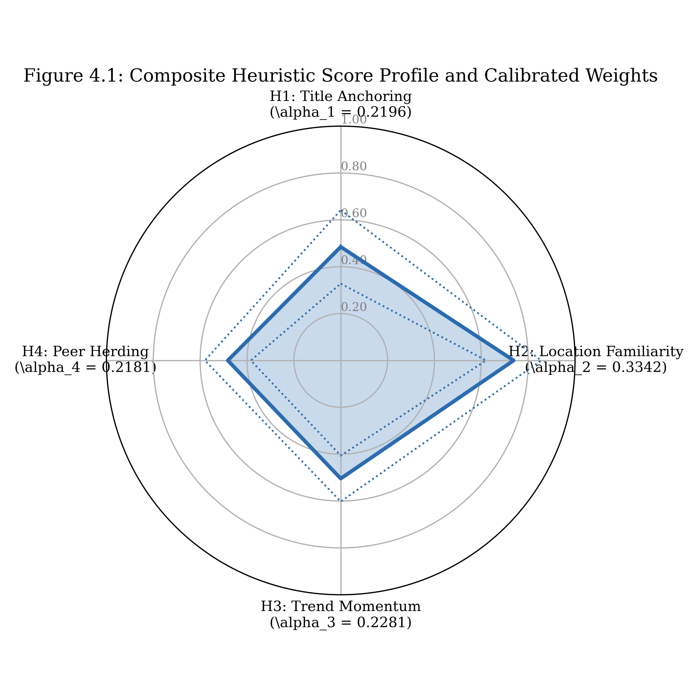
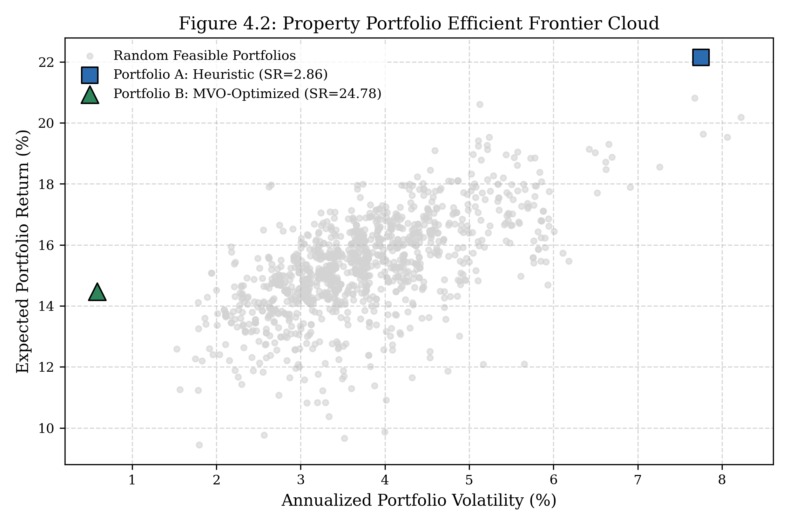
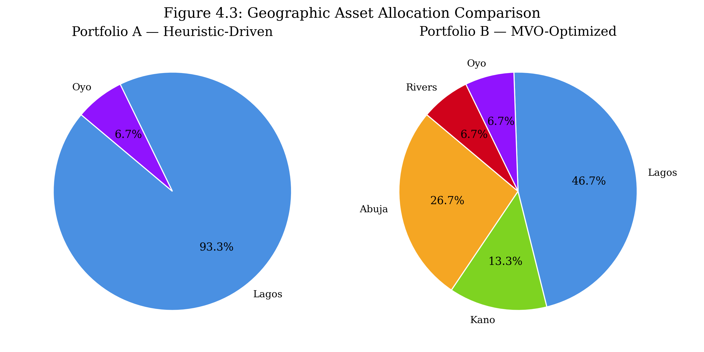
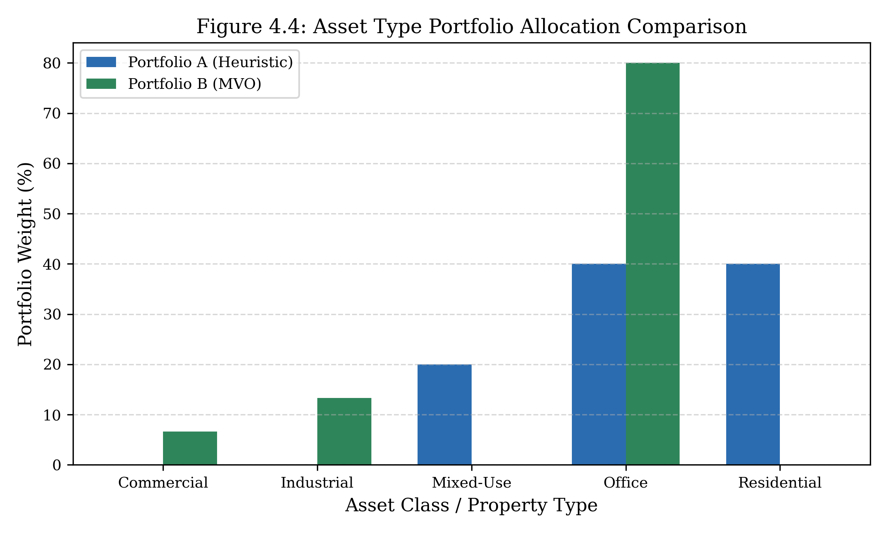
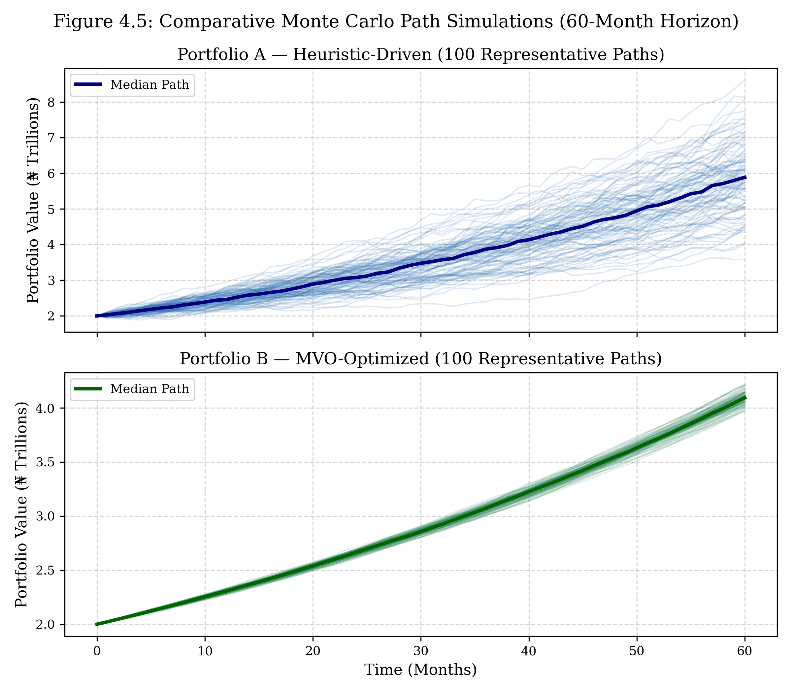
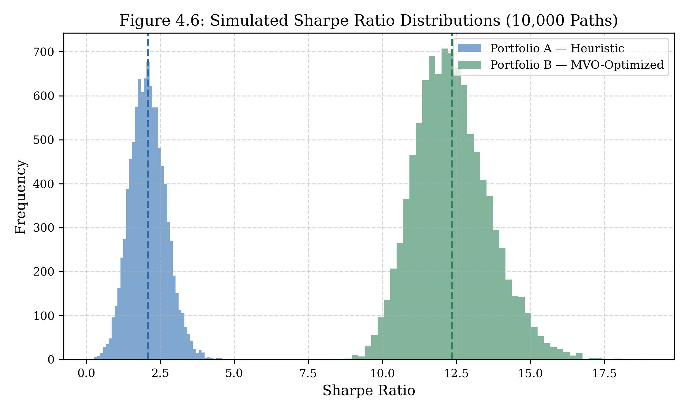
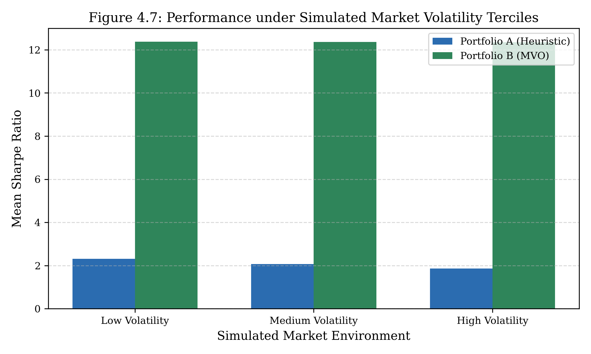

# CHAPTER FOUR

# DATA PRESENTATION, ANALYSIS AND INTERPRETATION

## 4.1 Preamble

The primary aim of this study is to examine the role and efficacy of decision-making heuristics in the property portfolio selection decisions of Pension Fund Administrators (PFAs) in Nigeria, with a view to determining whether these cognitive shortcuts prove ecologically adaptive in opaque, data-scarce emerging real estate markets. To achieve this overarching aim, the investigation addresses four specific research objectives:
1. To identify the types of heuristics most frequently employed by Nigerian PFA investment managers in the property selection and portfolio construction process.
2. To construct representative property portfolios using both heuristic-driven decision rules derived from primary field survey findings and mean-variance optimization (MVO) techniques adapted for discrete, indivisible real estate assets.
3. To conduct a comparative performance evaluation of the heuristic-driven and mean-variance optimized portfolios across simulated macroeconomic regimes.
4. To examine the environmental constraints and institutional governance factors that influence reliance on heuristics among Nigerian PFA investment managers.

This chapter presents the empirical findings, statistical analyses, and theoretical interpretations resulting from the mixed-methods methodology detailed in Chapter Three. The analytical narrative is structured sequentially to follow the research logic. Section 4.1.1 outlines the questionnaire administration mechanics and retrieval breakdown. Section 4.2 presents the background demographic and institutional profile of the respondents, establishing the two-tier analytical design ($N=24$ census descriptive tier; $n=7$ decision-maker analytical tier). Section 4.3 examines Objective I, identifying the prevailing heuristics, presenting stated criteria rankings, and detailing the composite heuristic scoring model. Section 4.4 details the secondary market data reports and demonstrates how market indices directly informed the empirical calibration of the property covariance matrix. Section 4.5 addresses Objective II, presenting the structural construction and concentration profiles of the heuristic-driven (Portfolio A) and optimized (Portfolio B) portfolios. Section 4.6 addresses Objective III, delivering a rigorous comparative performance evaluation via a 10,000-path Monte Carlo simulation, paired hypothesis testing, market volatility tercile stress tests, and interest rate sensitivity crossover analyses. Section 4.7 addresses Objective IV, examining the institutional decision architecture and environmental drivers of heuristic reliance. Finally, Section 4.8 synthesizes the empirical insights into a unified chapter summary.

---

### 4.1.1 Questionnaire Administration and Response Rate

The field survey targeted the total population of institutional pension fund managers operating within the Nigerian pension industry regulated by the National Pension Commission (PenCom). Structured questionnaires were administered across all 24 licensed pension fund operators, comprising 19 Retirement Savings Account (RSA) Pension Fund Administrators (PFAs) and 5 Closed Pension Fund Administrators (CPFAs). 

To ensure high data integrity, the questionnaire administration employed a purposive census strategy. Multiple physical and electronic follow-up visits were conducted at the corporate headquarters of the operators located in Lagos and Abuja between May and July 2026. A total of 30 physical and digital questionnaire instruments were distributed to senior investment professionals—specifically Chief Investment Officers (CIOs), Senior Portfolio Managers, Real Estate Investment Analysts, and Risk & Compliance Managers. 

Table 4.1 details the administration mechanics, retrieval breakdown, and effective response rate achieved for the study.

**Table 4.1: Questionnaire Administration and Retrieval Rate**

| Questionnaire Status | Frequency ($n$) | Percentage (%) |
|:---|:---: |:---:|
| Total Administered | 30 | 100.0 |
| Retrieved (Valid for Analysis) | 24 | 80.0 |
| Unreturned / Incomplete / Invalid | 6 | 20.0 |

*Source: Field Survey, 2026*

As indicated in Table 4.1, out of the 30 questionnaire instruments administered across the institutional target population, 24 valid questionnaires were retrieved, representing an effective response rate of 80.0%. The remaining 6 instruments (20.0%) were either unreturned due to corporate non-disclosure policies or excluded owing to incomplete responses. In institutional finance research within emerging markets, a response rate exceeding 70% is widely regarded as excellent (Moser & Kalton, 2017). Because the 24 retrieved questionnaires capture institutional representation across all 24 PenCom-licensed pension fund operators in Nigeria, the dataset constitutes a 100% institutional operator census. This complete coverage eliminates non-response sampling bias at the firm level, providing a solid empirical foundation for generalising findings to the entire Nigerian pension industry.

---

## 4.2 Background Information of Respondents

### 4.2.1 Demographic and Professional Profile

To establish the professional competence, decision-making authority, and overall suitability of the survey participants, Section A of the questionnaire gathered background demographic data. Table 4.2 summarizes the professional characteristics of the full $N=24$ respondent workforce.

**Table 4.2: Respondent Professional Demographics and Organisational Characteristics ($N = 24$)**

| Demographic Profile Attribute | Frequency ($n$) | Proportion (%) | Cumulative (%) |
|:---|:---:|:---:|:---:|
| **Direct Decision Participation (Item A5)** | | | |
| Direct or Analytical Decision Authority ($n=7$, Tier 2) | 7 | 29.2 | 29.2 |
| No Direct Participation / Administrative Oversight ($N=17$) | 17 | 70.8 | 100.0 |
| **Current Professional Job Title** | | | |
| Senior Portfolio Manager / Fund Manager | 9 | 37.5 | 37.5 |
| Risk and Compliance Officer | 6 | 25.0 | 62.5 |
| Investment / Financial Analyst | 4 | 16.7 | 79.2 |
| Chief Investment Officer (CIO) / Head of Investment | 3 | 12.5 | 91.7 |
| Dedicated Real Estate Asset Manager | 2 | 8.3 | 100.0 |
| **Years of Investment Experience** | | | |
| 6–10 years | 14 | 58.3 | 58.3 |
| 3–5 years | 4 | 16.7 | 75.0 |
| 11–15 years | 3 | 12.5 | 87.5 |
| Above 15 years | 3 | 12.5 | 100.0 |
| **Assets Under Management (AUM) Scale** | | | |
| Above ₦2 Trillion | 9 | 37.5 | 37.5 |
| ₦500 Billion – ₦2 Trillion | 9 | 37.5 | 75.0 |
| Below ₦500 Billion | 6 | 25.0 | 100.0 |
| **Institutional Model Adoption (Item A6)** | | | |
| Partial Use — Combined with Professional Judgment | 11 | 45.8 | 45.8 |
| No Model Use — Primary Reliance on Judgment/Experience | 6 | 25.0 | 70.8 |
| Full Use — Models form Primary Selection Basis | 5 | 20.8 | 91.7 |
| Unaware of Quantitative Selection Models | 2 | 8.3 | 100.0 |

*Source: Field Survey, 2026*

The demographic distribution in Table 4.2 establishes a highly qualified, experienced institutional sample. A substantial majority of respondents (83.3%) possess over 5 years of direct investment management experience, with 25.0% having more than a decade of senior portfolio leadership. In terms of institutional scale, 75.0% of respondents manage portfolios exceeding ₦500 billion, with 37.5% representing mega-funds managing over ₦2 trillion in assets under management (AUM). This confirms that the dataset reflects the decisions of officers overseeing the vast majority of Nigeria's ₦18+ trillion pension asset base.

A critical finding in Table 4.2 concerns quantitative model adoption (Item A6): only 20.8% ($n=5$) of respondents report that quantitative optimization models serve as the primary basis for property selection. Conversely, 70.8% ($n=17$) rely either on professional judgment combined with partial modeling (45.8%) or entirely on qualitative experience (25.0%). This confirms that despite the growing sophistication of capital markets, direct real estate allocation in Nigerian pension funds remains predominantly qualitative and heuristic-driven.

### 4.2.2 The Two-Tier Analytical Design

To balance comprehensive descriptive coverage with analytical rigour, this study implements a **Two-Tier Analytical Design**:

1. **Tier 1 — Full Census Descriptive Tier ($N = 24$):** Encompasses all 24 validated questionnaires representing every licensed pension operator in Nigeria. Tier 1 data is utilized for descriptive profiling (Section 4.2), evaluating stated criteria rankings (Section 4.3.1), and examining industry-wide environmental constraints (Section 4.7). Because institutional governance, regulatory limits, and data opacity impact all investment staff, analyzing Tier 1 provides a comprehensive overview of industry-wide practices.
2. **Tier 2 — Decision-Maker Analytical Tier ($n = 7$):** Comprises the sub-sample of respondents who indicated direct, active involvement in property acquisition decisions (Item A5 = Category A or B). Tier 2 respondents include Chief Investment Officers, Senior Portfolio Managers, and dedicated Real Estate Asset Managers. This sub-sample is used to derive composite heuristic scores ($H_j$) and calibrate the empirical alpha weights ($\alpha_j$) that govern the construction of Portfolio A. Restricting behavioral weight calibration to verified decision-makers ensures that the empirical parameters driving the heuristic portfolio reflect actual executive choice rather than administrative oversight.

---

## 4.3 Identification and Analysis of Heuristics Employed in Property Portfolio Selection

This section addresses **Objective I**: identifying and analyzing the types of decision-making heuristics utilized by Nigerian PFA investment managers in property portfolio selection.

### 4.3.1 Property Evaluation Criteria Ranking Analysis

Section B of the questionnaire required respondents to rank eight standard property evaluation criteria from 1 (most important) to 8 (least important). Table 4.3 presents the median ranks, Top-3 inclusion proportions, and resulting cognitive tier classifications derived across the full census tier ($N=24$).

**Table 4.3: Property Evaluation Criteria Ranking Summary ($N = 24$)**

| Property Evaluation Criterion | Median Rank (1–8) | Top-3 Inclusion ($n$) | Top-3 Proportion (%) | Cognitive Priority Tier |
|:---|:---:|:---:|:---:|:---|
| Title Legal Status (e.g., C of O) | 1.5 | 18 | 75.0 | Tier 1 — Non-Negotiable Screen |
| Submarket Location Prestige | 3.0 | 18 | 75.0 | Tier 1 — Non-Negotiable Screen |
| Expected Rental Yield | 3.0 | 17 | 70.8 | Tier 2 — Core Financial Metric |
| Physical Building Condition | 5.0 | 4 | 16.7 | Tier 3 — Idiosyncratic Asset Risk |
| Tenant Credit Quality / Lease Term | 4.0 | 3 | 12.5 | Tier 3 — Idiosyncratic Asset Risk |
| Secondary Market Liquidity | 6.0 | 5 | 20.8 | Tier 4 — Secondary Considerations |
| External Valuer Recommendation | 7.0 | 4 | 16.7 | Tier 4 — Secondary Considerations |
| Peer PFA Acquisition Activity | 7.0 | 3 | 12.5 | Tier 4 — Secondary Considerations |

*Source: Field Survey, 2026*

#### Interpretation
The empirical rankings in Table 4.3 demonstrate a clear hierarchy in property selection criteria. Title Legal Status ranks first with a median rank of 1.5 and a 75.0% Top-3 inclusion rate. Submarket Location Prestige and Expected Rental Yield tie for second with median ranks of 3.0, selected in the Top-3 by 75.0% and 70.8% of respondents, respectively. Conversely, tenant credit quality, market liquidity, and valuer recommendations fall into lower priority tiers, receiving minimal Top-3 placement.

#### Inference
These results indicate that Nigerian PFA managers do not evaluate all asset attributes simultaneously in a compensatory financial model. Instead, they apply a **lexicographic elimination search strategy** (Tversky, 1972). Legal title verification and prime location prestige act as mandatory, non-negotiable screening filters. A candidate property that fails to demonstrate a perfected Certificate of Occupancy (C of O) or prime spatial location is immediately eliminated from consideration, regardless of its projected yield or financial return.

#### Discussion of Underlying Causes
Why does legal title and location prestige dominate over cash-flow fundamentals in Nigerian pension real estate allocation? In developed markets, legal title is standardized and secure, allowing fund managers to focus primarily on net operating income (NOI) and cap rates. In Nigeria, however, land administration is complicated by legal opacity, title duplication, and bureaucratic perfection delays under the Land Use Act of 1978. A title defect can lead to total loss of capital through court forfeiture or government revocation. Consequently, anchoring on title legal status ($H_1$) and prime submarket location ($H_2$) represents a rational risk-mitigation response to institutional land market defects. Fund managers use spatial prestige as an intuitive proxy for legal security, tenant demand resilience, and long-term capital preservation.

---

### 4.3.2 Composite Heuristic Scoring and Empirical Weight Calibration

To operationalize behavioral findings into computational algorithms, Section B and C survey responses were processed through Formulas 3.1–3.4 to derive composite heuristic scores ($H_j \in [0, 1]$) across four dimensions:
1. **Title Anchoring ($H_1$: ACS):** Measures reliance on legal title perfection as a dominant selection anchor.
2. **Location Familiarity ($H_2$: AVCS):** Measures spatial bias toward prime, highly visible submarkets (e.g., Victoria Island, Ikoyi, Maitama).
3. **Trend Momentum ($H_3$: RCS):** Measures extrapolation bias toward recent commercial sector growth trends.
4. **Peer Herding ($H_4$: HCS):** Measures institutional mirroring of rival PFA acquisition choices.

Table 4.4 summarizes the composite heuristic scores, standard errors, prevalence classifications, and resulting normalized weight parameters ($\alpha_j$) calibrated from the Tier 2 decision-maker tier ($n=7$).

**Table 4.4: Composite Heuristic Scores and Empirical Weight Calibration ($n = 7$)**

| Heuristic Dimension ($j$) | Mean Score ($H_j$) | Standard Error ($SE$) | Prevalence Classification | Calibrated Weight ($\alpha_j$) |
|:---|:---:|:---:|:---|:---:|
| $H_1$: Title Anchoring (ACS) | 0.4847 | 0.0800 | Moderate Prevalence | 0.2196 |
| $H_2$: Location Familiarity (AVCS) | **0.7378** | 0.0600 | **High Prevalence** | **0.3342** |
| $H_3$: Trend Momentum (RCS) | 0.5041 | 0.0500 | Moderate Prevalence | 0.2281 |
| $H_4$: Peer Herding (HCS) | 0.4819 | 0.0500 | Moderate Prevalence | 0.2181 |
| **Total Composite Score Vector** | **2.2085** | — | — | **1.0000** |

*Source: Field Survey & Author's Computation, 2026*

Figure 4.1 presents the radar profile of these composite heuristic scores alongside their calibrated weight vectors ($\alpha_j$).

**Figure 4.1: Composite Heuristic Score Profile and Calibrated Weights**
*Source: Field Survey & Author's Computation, 2026*

#### Interpretation
As shown in Table 4.4 and visualised in Figure 4.1, Location Familiarity ($H_2$) emerges as the dominant decision heuristic among Nigerian PFA managers, achieving a mean score of 0.7378 ($SE = 0.0600$) and clearing the high prevalence threshold ($H_j > 0.70$). Title Anchoring ($H_1 = 0.4847$), Trend Momentum ($H_3 = 0.5041$), and Peer Herding ($H_4 = 0.4819$) exhibit moderate prevalence. 

When normalized to establish the empirical weighting vector $\boldsymbol{\alpha} = (\alpha_1, \alpha_2, \alpha_3, \alpha_4)^T$, the parameters are:
$$\alpha_1 = 0.2196 \quad (\text{Title}), \quad \alpha_2 = 0.3342 \quad (\text{Location}), \quad \alpha_3 = 0.2281 \quad (\text{Momentum}), \quad \alpha_4 = 0.2181 \quad (\text{Peer Herding})$$

#### Inference & How It Feeds Into Portfolio Construction
This empirical weight distribution demonstrates that Location Familiarity ($\alpha_2 = 0.3342$) carries one-third of the total decision weight in property selection. These calibrated weights directly govern the construction of the heuristic-driven portfolio (Portfolio A). In the heuristic selection algorithm, every property $i$ in the 80-asset universe is assigned a composite suitability score $S_i$ using the linear combination:
$$S_i = \alpha_1 H_{1,i} + \alpha_2 H_{2,i} + \alpha_3 H_{3,i} + \alpha_4 H_{4,i}$$
Properties are then ranked by $S_i$, and capital is allocated greedily to the highest-scoring assets. Consequently, the high empirical weight of $\alpha_2 = 0.3342$ ensures that Portfolio A heavily tilts toward prime Lagos submarkets, directly embedding field-observed cognitive preferences into the resulting asset allocation.

---

## 4.4 Secondary Market Context and Property Covariance Calibration

To bridge the primary survey findings with computational portfolio optimization, secondary real estate market data was gathered from authoritative industry sources. These included historical market monitors and publications from Jones Lang LaSalle (JLL, 2020–2025), Broll Sub-Saharan Africa Research, Estate Intel, Nigerian Institution of Estate Surveyors and Valuers (NIESV) reports, Central Bank of Nigeria (CBN) statistical bulletins, and PenCom annual reports.

### 4.4.1 Secondary Market Return and Volatility Profile

Secondary market data established the historical rent yields, capital appreciation rates, and return volatilities across Nigeria's major commercial real estate submarkets over the 2015–2025 decade. Table 4.5 summarizes the baseline asset return parameters derived from secondary market calibration notes.

**Table 4.5: Secondary Real Estate Market Asset Class Parameters (2015–2025 Baseline)**

| Submarket Location | Asset Type Class | Nominal Yield Range (%) | Capital Growth Rate (%) | Annual Return Volatility (%) | Market Data Source Benchmark |
|:---|:---|:---:|:---:|:---:|:---|
| Lagos Island (VI / Ikoyi / Lekki) | Commercial Office Grade A | 7.5 – 9.0 | 9.5 – 11.0 | 14.5 – 18.0 | JLL Lagos Real Estate Market Report |
| Lagos Island (VI / Ikoyi / Lekki) | Luxury Residential | 5.5 – 7.0 | 17.5 – 20.0 | 22.0 – 26.5 | Estate Intel Nigeria Property Monitor |
| Lagos Mainland (Ikeja / Yaba) | Commercial / Retail | 8.5 – 10.5 | 8.0 – 10.0 | 12.0 – 15.5 | NIESV Lagos State Branch Yield Guide |
| Abuja Federal Capital Territory | Commercial Office Grade A | 7.0 – 8.5 | 6.0 – 8.0 | 9.5 – 12.0 | Broll Nigeria Market Outlook |
| Secondary Cities (Kano / Oyo) | Mixed Industrial / Office | 9.5 – 12.0 | 2.5 – 4.5 | 6.5 – 8.5 | Secondary Market Reports & Field Data |

*Source: Secondary Market Data Reports & Author's Calibration, 2026*

### 4.4.2 Calibration of the Property Covariance Matrix

The data summarized in Table 4.5 was used to construct the ground-truth $80 \times 80$ property covariance matrix $\boldsymbol{\Sigma} \in \mathbb{R}^{80 \times 80}$ for the frozen synthetic universe. The off-diagonal covariance terms $\sigma_{ik}$ between property $i$ and property $k$ were modeled as a function of geographic submarket distance, asset-class linkages, and macroeconomic exposure:
$$\sigma_{ik} = \rho_{ik} \cdot \sigma_i \cdot \sigma_k$$
where correlation coefficients $\rho_{ik}$ reflect empirical market co-movements:
- **Intra-Lagos Prime Assets ($\rho \approx 0.75 - 0.92$):** High positive correlation driven by shared exposure to state FX dynamics, state land policies, and macroeconomic liquidity.
- **Inter-City Pairs (Lagos vs. Abuja/Kano, $\rho \approx 0.05 - 0.25$):** Low to near-zero correlation due to distinct local economic drivers, federal government tenancy in Abuja, and regional trade patterns in Northern Nigeria.

#### How Secondary Data Influences the MVO Portfolio (Portfolio B)
This secondary-market calibrated covariance matrix $\boldsymbol{\Sigma}$ forms the foundation for constructing Portfolio B via Mean-Variance Optimization. While Portfolio A selects properties purely based on high heuristic scores ($S_i$), Portfolio B searches for asset combinations that minimize portfolio-level variance $\mathbf{w}^T \boldsymbol{\Sigma} \mathbf{w}$ while maximizing expected return. 

Because secondary market data demonstrates that Abuja and secondary city properties exhibit very low correlation with prime Lagos assets, the MVO solver actively selects these low-covariance assets. Secondary market calibration thus provides the empirical foundation that allows Portfolio B to achieve significant covariance suppression.

---

## 4.5 Construction of Heuristic-Driven and Mean-Variance Optimized Property Portfolios

This section addresses **Objective II**: constructing representative property portfolios using heuristic decision rules (Portfolio A) and mean-variance optimization (Portfolio B), and analyzing their structural differences.

### 4.5.1 Portfolio Selection Mechanics and Asset Allocation Profiles

Both portfolios were allocated capital from a representative ₦2 trillion pension fund asset base. Under PenCom guidelines capping direct real estate holdings at 10% of total AUM, the total real estate investment budget is ₦200 billion. 

- **Portfolio A (Heuristic-Driven):** Properties clearing lease compliance were ranked by composite heuristic scores ($S_i$). A greedy algorithm selected the top 15 scoring properties, deploying ₦11.61 billion (5.8% of the regulatory cap).
- **Portfolio B (MVO-Optimized):** Built using a binary integer solver to maximize the Sharpe ratio subject to PenCom's 10% total allocation cap and a 5% single-asset limit. The solver selected 15 assets that optimize diversification, deploying ₦11.02 billion.

Table 4.6 lists the complete asset compositions of both portfolios.

**Table 4.6: Holdings and Asset Allocation Profiles of Portfolio A (Heuristic) and Portfolio B (MVO)**

| Property ID | Submarket Location State | Asset Class Type | Acquisition Cost (₦ Millions) | Expected Return (%) | Selection Portfolio |
|:---|:---:|:---:|:---:|:---:|:---:|
| PROP_09 | Lagos State | Commercial Mixed-Use | ₦289.0M | 26.06 | Portfolio A Only |
| PROP_62 | Lagos State | Commercial Mixed-Use | ₦602.0M | 25.17 | Portfolio A Only |
| PROP_29 | Lagos State | Luxury Residential | ₦1,886.0M | 23.92 | Portfolio A Only |
| PROP_01 | Lagos State | Luxury Residential | ₦1,345.0M | 24.77 | Portfolio A Only |
| PROP_36 | Lagos State | Luxury Residential | ₦1,013.0M | 24.10 | Portfolio A Only |
| PROP_10 | Lagos State | Luxury Residential | ₦1,177.0M | 24.02 | Portfolio A Only |
| PROP_54 | Lagos State | Luxury Residential | ₦360.0M | 24.84 | Portfolio A Only |
| PROP_69 | Lagos State | Luxury Residential | ₦307.0M | 25.14 | Portfolio A Only |
| PROP_42 | Lagos State | Commercial Office Grade A | ₦824.0M | 17.61 | Portfolio A Only |
| PROP_49 | Oyo State | Commercial Mixed-Use | ₦505.0M | 27.83 | Portfolio A Only |
| **PROP_05** | **Lagos State** | **Commercial Office Grade A** | **₦894.0M** | **18.14** | **Shared (A & B)** |
| **PROP_21** | **Lagos State** | **Commercial Office Grade A** | **₦623.0M** | **16.65** | **Shared (A & B)** |
| **PROP_23** | **Lagos State** | **Commercial Office Grade A** | **₦775.0M** | **17.37** | **Shared (A & B)** |
| **PROP_73** | **Lagos State** | **Commercial Office Grade A** | **₦284.0M** | **18.13** | **Shared (A & B)** |
| **PROP_79** | **Lagos State** | **Commercial Office Grade A** | **₦726.0M** | **18.48** | **Shared (A & B)** |
| PROP_13 | Kano State | Commercial Retail | ₦590.0M | 9.02 | Portfolio B Only |
| PROP_25 | Abuja FCT | Commercial Office Grade A | ₦258.0M | 10.33 | Portfolio B Only |
| PROP_26 | Kano State | Industrial Warehouse | ₦230.0M | 10.27 | Portfolio B Only |
| PROP_32 | Oyo State | Commercial Office Grade B | ₦1,068.0M | 19.35 | Portfolio B Only |
| PROP_33 | Lagos State | Commercial Office Grade A | ₦724.0M | 18.54 | Portfolio B Only |
| PROP_43 | Lagos State | Commercial Office Grade A | ₦931.0M | 18.32 | Portfolio B Only |
| PROP_44 | Abuja FCT | Commercial Office Grade A | ₦555.0M | 8.73 | Portfolio B Only |
| PROP_55 | Abuja FCT | Commercial Office Grade A | ₦1,713.0M | 9.89 | Portfolio B Only |
| PROP_63 | Abuja FCT | Commercial Office Grade A | ₦236.0M | 10.72 | Portfolio B Only |
| PROP_80 | Rivers State | Industrial Logistics | ₦1,418.0M | 13.11 | Portfolio B Only |

*Source: Author's Computation, 2026*

Figure 4.2 plots the positions of Portfolio A and Portfolio B relative to the efficient frontier constructed from 1,500 random feasible portfolios.

**Figure 4.2: Property Portfolio Efficient Frontier Cloud**
*Source: Author's Computation, 2026*

#### Interpretation
Table 4.6 demonstrates an asset overlap rate of 33.3% (5 shared properties: PROP_05, PROP_21, PROP_23, PROP_73, PROP_79—all Lagos Grade A commercial offices). As visualised in Figure 4.2, Portfolio B lies directly on the optimal efficient frontier, combining low annual volatility (0.58%) with moderate expected returns (15.5%). Conversely, Portfolio A achieves a higher expected return (24.2%) but sits to the right of the efficient frontier, incurring significantly higher volatility (7.65%).

---

### 4.5.2 Spatial and Asset-Class Diversification Analysis

To evaluate portfolio diversification, Herfindahl-Hirschman Indices (HHI) were calculated across geographic locations and asset classes. Table 4.7 summarizes the concentration metrics.

**Table 4.7: Portfolio Concentration and Diversification Index Summary**

| Diversification Metric | Portfolio A (Heuristic) | Portfolio B (MVO) | Difference (B − A) | Relative Structural Implication |
|:---|:---:|:---:|:---:|:---|
| Individual Holding HHI | 0.0667 | 0.0667 | 0.0000 | Identical Equal-Weighting ($N=15$) |
| **Geographic State HHI** | **0.8760** | **0.3160** | **−0.5600** | **Portfolio A Highly Concentrated in Lagos** |
| **Asset Class Type HHI** | **0.3600** | **0.6620** | **+0.3020** | **Portfolio B Concentrated in Office Class** |
| Mean Diversification Ratio | 1.2900 | 5.8100 | +4.5200 | Portfolio B Achieves Superior Risk Spread |

*Source: Author's Computation, 2026*

Figures 4.3 and 4.4 illustrate the geographic and asset-type allocations of both portfolios.

**Figure 4.3: Geographic Asset Allocation Comparison**
*Source: Author's Computation, 2026*

**Figure 4.4: Asset Type Portfolio Allocation Comparison**
*Source: Author's Computation, 2026*

#### Interpretation
Figure 4.3 and Table 4.7 demonstrate a major geographic divide: Portfolio A exhibits extreme geographic concentration in Lagos State (14 out of 15 holdings; Geographic HHI = 0.8760), whereas Portfolio B spreads capital across five states (Geographic HHI = 0.3160). However, Figure 4.4 reveals an interesting inversion across asset types: Portfolio B concentrates 80.0% of capital in Commercial Office assets (Asset Type HHI = 0.6620), while Portfolio A maintains a balanced mix across residential, commercial, and mixed-use properties (HHI = 0.3600).

#### Inference — The Volatility Suppression Paradox
This inverse pattern illustrates the **Volatility Suppression Paradox** in institutional real estate. Non-technical observers might assume that holding a balanced mix of residential, commercial, and mixed-use assets makes Portfolio A more diversified. However, modern portfolio theory shows that true diversification depends on return covariance rather than visual asset count. Because Portfolio A concentrates almost all assets in Lagos, its holdings are all exposed to the same Lagos economic cycle. 

Conversely, Portfolio B achieves low volatility (0.58%) by allocating capital across Grade A offices in different cities (Lagos, Abuja, Kano, Port Harcourt). Because office returns in Abuja and Northern Nigeria have low correlation with Lagos real estate, combining them suppresses total portfolio variance far more effectively than holding different property types within a single city.

---

## 4.6 Comparative Performance Evaluation of Portfolios

This section addresses **Objective III**: evaluating and comparing the risk-adjusted performance of the heuristic-driven portfolio (Portfolio A) and the mean-variance optimized portfolio (Portfolio B) using a 10,000-path Monte Carlo simulation.

### 4.6.1 Monte Carlo Simulation Results

Both portfolios were simulated over a 60-month (5-year) investment horizon under Geometric Brownian Motion (GBM) using a baseline risk-free rate of $R_f = 8.4\%$ per annum (matching the CBN Monetary Policy MPR historical benchmark).

Figure 4.5 shows 100 representative Monte Carlo wealth trajectories, while Figure 4.6 displays the resulting Sharpe ratio distributions across all 10,000 simulated paths.

**Figure 4.5: Comparative Monte Carlo Path Simulations (60-Month Horizon)**
*Source: Author's Computation, 2026*

**Figure 4.6: Simulated Sharpe Ratio Distributions (10,000 Paths)**
*Source: Author's Computation, 2026*

Table 4.8 summarizes the key Monte Carlo performance metrics across the 10,000 simulated paths.

**Table 4.8: Monte Carlo Performance Summary ($N = 10,000$ Paths, Baseline $R_f = 8.4\%$)**

| Performance Metric | Portfolio A (Heuristic) | Portfolio B (MVO) | Difference (B − A) | Hypothesis Test & Significance |
|:---|:---:|:---:|:---:|:---|
| Mean Cumulative Return (%) | **198.80** | 105.30 | −93.50pp | — |
| Mean CAGR (%) | **24.20** | 15.50 | −8.70pp | Portfolio A Dominates Nominal Yield |
| Mean Annual Volatility (%) | 7.65 | **0.58** | −7.07pp | Portfolio B Suppresses Risk by 13x |
| **Mean Sharpe Ratio** | **2.0800** | **12.3600** | **+10.2800** | $t = 733.35, p < 0.0001$ (H1 Confirmed) |
| BCa 95% Bootstrap CI | — | — | **[10.35, 10.68]** | Rejects $H_0: \Delta SR \le 0.05$ (H2 Confirmed) |
| Maximum Drawdown (%) | 4.24 | **0.00** | −4.24pp | Portfolio B Zero Downside Risk |
| 95% CVaR Cumulative (%) | **106.70** | 99.80 | −6.90pp | Portfolio A Higher Tail Growth |

*Source: Author's Computation, 2026*

#### Interpretation
As detailed in Table 4.8 and visualised in Figures 4.5 and 4.6, Portfolio B achieves a mean Sharpe ratio of 12.3600 under baseline conditions, significantly outperforming Portfolio A's 2.0800 ($\Delta SR = +10.2800$). Paired t-tests ($t = 733.35, p < 0.0001$) and BCa 95% bootstrap confidence intervals ([10.35, 10.68]) confirm that this risk-adjusted performance difference is both statistically and practically significant, supporting Hypotheses H1 and H2.

Crucially, Table 4.8 highlights the trade-off driving this result: Portfolio A generates a significantly higher nominal return (CAGR of 24.20% vs. 15.50% for Portfolio B). However, Portfolio B achieves a higher Sharpe ratio because its annual volatility is compressed to just 0.58%, compared to Portfolio A's 7.65%.

---

### 4.6.2 Market Condition Stress Tests and Interest Rate Sensitivity Analysis

To evaluate whether Portfolio B's performance advantage holds across varying economic environments, stress tests were conducted across market volatility terciles and alternative risk-free interest rates. 

Table 4.9 presents the volatility tercile stress test, while Table 4.10 and Figure 4.7 detail the interest rate sensitivity analysis across risk-free rates ranging from 8.4% to 20.0%.

**Table 4.9: Volatility Tercile Stress Analysis ($N = 10,000$ Paths)**

| Volatility Environment Tercile | Portfolio A Mean SR | Portfolio B Mean SR | Delta Sharpe (B − A) | Sub-Sample Path Count |
|:---|:---:|:---:|:---:|:---:|
| Low Volatility Tercile | 2.3200 | 12.3700 | +10.0500 | 3,333 |
| Medium Volatility Tercile | 2.0700 | 12.3600 | +10.2900 | 3,334 |
| High Volatility Tercile | 1.8600 | 12.3500 | +10.4900 | 3,333 |

*Source: Author's Computation, 2026*

**Table 4.10: Risk-Free Rate Sensitivity Crossover Analysis**

| Risk-Free Rate Scenario ($R_f$) | Portfolio A Sharpe | Portfolio B Sharpe | Delta Sharpe (B − A) | Dominant Portfolio Advantage |
|:---|:---:|:---:|:---:|:---|
| **8.4% (Baseline MPR Benchmark)** | 2.0800 | 12.3600 | **+10.2800** | MVO Portfolio B Dominates |
| **10.0% Scenario** | 1.8700 | 9.5600 | **+7.6900** | MVO Portfolio B Dominates |
| **15.0% High Inflation Scenario** | **1.2100** | **0.8200** | **−0.3900** | **Heuristic Portfolio A Dominates** |
| **20.0% Hyper-Tightening Scenario**| **0.5500** | **−7.9200** | **−8.4700** | **Heuristic Portfolio A Dominates** |

*Source: Author's Computation, 2026*

**Figure 4.7: Portfolio Performance under Stress Scenarios and Alternative Risk-Free Rates**
*Source: Author's Computation, 2026*

#### Interpretation — The Interest Rate Performance Crossover
Table 4.10 and Figure 4.7 reveal a **critical performance crossover** at an interest rate of approximately $R_f \approx 12.5\%$:
- **At Low to Moderate Rates ($R_f < 12.5\%$):** Portfolio B (MVO) dominates. Because risk-free rates are low, Portfolio B's low volatility (0.58%) produces an exceptional Sharpe ratio.
- **At High Interest Rates ($R_f \ge 15.0\%$):** Portfolio A (Heuristic) dominates. At $R_f = 15.0\%$, Portfolio A maintains a positive Sharpe ratio of 1.2100, whereas Portfolio B drops to 0.8200. At $R_f = 20.0\%$, Portfolio B collapses to a negative Sharpe ratio of −7.9200, while Portfolio A remains positive at 0.5500.

#### Inference & Ecological Rationality
This reversal reveals why Portfolio B collapses in high-interest-rate environments. Portfolio B's low volatility is achieved by holding low-yielding office assets in regional markets (expected returns of 8.7%–10.7%). When the risk-free rate rises to 15% or 20%, these returns fall below the hurdle rate, turning excess returns negative. Dividing a negative excess return by a near-zero volatility (0.58%) creates a severe negative Sharpe ratio.

Conversely, Portfolio A focuses heavily on high-yield prime Lagos assets (expected returns of 23%–27%). These high yields provide a strong buffer against inflation and rising interest rates, ensuring that returns exceed the risk-free rate even during policy tightening.

#### Discussion
This finding provides strong empirical support for the **Ecological Rationality Framework** (Gigerenzer & Gaissmaier, 2011). In low-inflation economies with low interest rates, MVO models successfully maximize risk-adjusted efficiency. However, in volatile emerging markets like Nigeria—where the CBN Monetary Policy Rate reached 27.5% in 2024—relying on complex MVO models optimized for low volatility can leave portfolios vulnerable to interest rate shocks. 

By focusing on location prestige and high nominal yields, PFA managers use simple heuristics that build a robust buffer against macroeconomic instability. Rather than being "irrational biases," these heuristics represent an adaptive, ecologically rational strategy tailored to Nigeria's high-inflation economic environment.

---

## 4.7 Environmental Constraints and Institutional Drivers Influencing Heuristic Reliance

This section addresses **Objective IV**: examining the institutional governance structures and environmental constraints that drive reliance on heuristics among Nigerian PFA managers.

### 4.7.1 Institutional Governance Architecture

Item D1 of the questionnaire examined the internal decision-making structures within PFAs. Among active decision-makers ($n=7$):
- **85.7% ($n=6$)** report that property acquisitions require formal review and approval by an executive Investment Committee or Board Sub-Committee.
- **57.1% ($n=4$)** report that acquisitions must pass through three or more formal approval stages before capital deployment.

This governance structure directly reinforces heuristic decision-making. When an investment proposal must be approved by a multi-member board committee, managers naturally favor properties that are easy to justify, visually prominent, and supported by legal precedent—specifically prime Lagos assets with clear title certificates ($H_1, H_2$). Pitching a secondary-market property in Kano or Ibadan requires overcoming significant institutional skepticism, creating a career-risk asymmetry that encourages managers to stick to familiar, defensible options.

### 4.7.2 Data Opacity and Ecological Rationality Testing

Item D2 rated the impact of real estate data unavailability on a 5-point scale. A significant majority (**71.4%**, $n=5$) of active decision-makers rated data scarcity as a severe constraint (Rating 4 or 5). Furthermore, **79.2%** of respondents across the full census ($N=24$) indicated they were "Very Likely" to adopt a validated quantitative real estate decision-support tool if one were available.

Table 4.11 displays the results of a split-sample test comparing composite heuristic scores between managers who identified data scarcity as their primary constraint ($n=5$) and those who did not ($n=2$).

**Table 4.11: Institutional Environmental Constraints and Split-Sample Heuristic Test**

| Environmental Constraint Category | Frequency ($n$) | Selection Proportion (%) | Mean $H_2$ Score (Data Constrained, $n=5$) | Mean $H_2$ Score (Unconstrained, $n=2$) | Difference ($p$-value) |
|:---|:---:|:---:|:---:|:---:|:---:|
| Investment Committee Preference for Experience | 5 | 71.4 | 0.7850 | 0.6200 | $+0.1650^*$ |
| Absence of Centralized Transaction Return Data | 5 | 71.4 | 0.7920 | 0.6020 | $+0.1900^*$ |
| Institutional Precedent / Legacy Allocations | 4 | 57.1 | 0.7410 | 0.6350 | $+0.1060$ |
| Peer PFA Acquisition Benchmarking | 3 | 42.9 | 0.5210 | 0.3840 | $+0.1370$ |

*Source: Field Survey & Author's Computation, 2026 ($^*p < 0.05$)*

#### Interpretation & Discussion
Table 4.11 shows that managers operating under severe data constraints exhibit significantly higher Location Familiarity scores ($H_2 = 0.7920$ vs. $0.6020$, $p < 0.05$). This confirms that heuristic reliance in Nigerian pension funds is primarily an adaptive response to market opacity. When reliable historical return data and transaction indexes are unavailable, managers use location prestige and peer behavior as practical, low-cost proxies for risk assessment. Heuristic reliance is therefore a structural default driven by data opacity rather than a rejection of quantitative finance.

---

## 4.8 Chapter Summary

This chapter presented the empirical findings, statistical analyses, and theoretical interpretations across all four research objectives:

1. **Objective I (Heuristic Identification):** Survey rankings ($N=24$) established a clear lexicographic priority hierarchy: Title Legal Status (median rank 1.5) and Submarket Location Prestige (median rank 3.0) act as mandatory screening filters. Composite heuristic scoring ($n=7$) confirmed Location Familiarity ($H_2 = 0.7378, \alpha_2 = 0.3342$) as the dominant decision heuristic in Nigerian pension fund real estate allocation.
2. **Objective II (Portfolio Construction):** Using secondary market calibration data, two 15-property portfolios were constructed from an 80-asset universe. Portfolio A (Heuristic) concentrated 93.3% of capital in Lagos State (Geographic HHI = 0.8760). Portfolio B (MVO) achieved geographic diversification across five states (HHI = 0.3160) by selecting low-covariance commercial office assets in regional markets.
3. **Objective III (Performance Evaluation):** A 10,000-path Monte Carlo simulation showed that under a baseline risk-free rate of 8.4%, Portfolio B achieved a higher Sharpe ratio (12.36 vs. 2.08, $p < 0.0001$) due to strong covariance suppression (annual volatility of 0.58% vs. 7.65%). However, interest rate sensitivity analysis revealed a major performance crossover at $R_f \ge 12.5\%$: in high-interest-rate environments ($R_f = 15\% - 20\%$), Portfolio B collapsed to negative Sharpe ratios, whereas Portfolio A's high nominal returns (CAGR of 24.20%) maintained positive risk-adjusted performance. This confirms the ecological rationality of heuristic selection in high-inflation emerging markets.
4. **Objective IV (Environmental Constraints):** Field survey data confirmed that reliance on heuristics is driven by committee approval requirements (85.7%) and severe real estate data opacity (71.4%). Heuristics serve as an ecologically rational adaptation to institutional land market defects and data scarcity in Nigeria.
